# Business Central Vendor Constraints: Research Report

**Question.** What are all the constraints to know before taking extracted vendor data from our OCR pipeline and creating a Microsoft Dynamics 365 Business Central (BC) vendor? And where in our pipeline should each one be handled?

**Scope and evidence.**
- Research date: 2026-09-29.
- **Target:** BC 22 on-prem, OData V4 at `…/BC220/ODataV4`, company *Netsmartz Infotech (India) Pri*, India vendors.
- **Repository** (`ShubhSonakiya18/Business-Central-Vendor-Extraction`):
  - `ocr-testing@a0e0fc8` (2026-09-29) for extraction and address segmentation;
  - `master@5677e46` (2026-09-21) for the BC push path.
- **Sources:** Microsoft's BC 22 India source (the exact version behind the tenant), Microsoft's official India apps on GitHub, Microsoft Learn, the Income Tax Department, and measurements run on the repo. Full list in [BC_VENDOR_RESEARCH_SOURCES.md](BC_VENDOR_RESEARCH_SOURCES.md).

**Companion documents**

| Doc | What's in it |
|---|---|
| [BC_VENDOR_FIELD_MATRIX.md](BC_VENDOR_FIELD_MATRIX.md) | Every relevant field: BC name, OData/API name, type, length, lookup, source class, repo field |
| [BC_VENDOR_CONSTRAINT_REGISTRY.md](BC_VENDOR_CONSTRAINT_REGISTRY.md) | 157 constraints with IDs (`C-xxx-nn`), type, severity, stage, method, automation class, error code |
| [BC_VENDOR_PIPELINE_INTEGRATION.md](BC_VENDOR_PIPELINE_INTEGRATION.md) | The 14 pipeline stages: inputs, checks, errors, outputs, owning module |
| [BC_VENDOR_VALIDATION_DESIGN.md](BC_VENDOR_VALIDATION_DESIGN.md) | Error taxonomy, automation classes, BC target profile, submission plan, address-fit algorithm, normalization policy |
| [BC_VENDOR_TEST_PLAN.md](BC_VENDOR_TEST_PLAN.md) | Tests per constraint, BC sandbox contract tests, exit criteria |
| [BC_VENDOR_RESEARCH_SOURCES.md](BC_VENDOR_RESEARCH_SOURCES.md) | Sources `[Sxx]` and measurements `[Mx]` |

**How claims are labelled.** Every constraint is tagged:

| Tag | Meaning |
|---|---|
| **STANDARD BC** | Standard Business Central behaviour |
| **INDIA LOCALIZATION** | Microsoft's India apps |
| **CONFIGURATION-DEPENDENT** | Depends on the tenant's setup data |
| **EXTENSION-DEPENDENT** | Depends on a tenant or partner extension |
| **CUSTOM BUSINESS RULE** | Our own rule, not BC's |
| **UNKNOWN / TENANT VERIFICATION REQUIRED** | Must be checked on the live server |

Recommendations and inferences are marked as such. Nothing in production code was changed for this research.

---

## 1. Executive Summary

**What we did.** We traced BC's own source code for the version the company runs (BC 22 with India localization) to find every rule that can reject or corrupt a vendor record. We then compared those rules with our extraction pipeline and our current Business Central push.

### Key findings

1. **The current BC push uses wrong field limits and truncates data.**
   - `master`'s `bc_mapper.py` assumes Name, Address and Contact are 50 characters.
   - In BC 22 they are **100** `[S02]`.
   - It then *cuts* longer values at a word boundary and still offers them for push. This breaks the rule that extracted data is never silently truncated.
   - Only **Address 2 is 50 characters**.

2. **The new address design fits BC's meaning of the fields but not BC's field sizes.**
   - BC gives Address and Address 2 no meaning (both are free text), so "premise in Address 1, locality in Address 2" is a valid company convention.
   - But the redesigned segmenter puts the *longer* part into the *shorter* field.
   - The repo's own canonical test address yields a **69-character Address 2** at "high" confidence `[M1]`.
   - The fix is a small, lossless post-step that shifts the boundary between Address 1 and Address 2 when needed. It is not a redesign (§7).

3. **India GST rules in BC are strict and depend on the order fields are written** `[S12][S13]`.
   - A GSTIN can only be saved after the vendor's GST State Code and PAN are set.
   - The GSTIN's first two digits must match the state's GST code.
   - Characters 3–12 must equal the PAN.
   - A blank GST Vendor Type silently clears the GSTIN.
   - OData doesn't document the order in which it validates fields, so these must be written as separate, ordered steps.

4. **BC does not check several things we assumed it would, so our pipeline must.** BC doesn't check:
   - the **GSTIN check character**;
   - **PAN format**;
   - **duplicate GSTIN, PAN or bank account**.

   The main evidence is BC's own source code `[S13]`. The GSTIN on the live vendor card (`29AADCP7742H1ZS`, stored in the tenant's custom "GST Number" field) also fails the check-character test: it is either test data or wrong, and nothing stopped it being saved. Our algorithm detects all 525 possible single-character errors on a verified GSTIN `[M5]`.

5. **Our cross-document checks are too lenient for identifiers.** GSTINs that differ by **two characters** and PANs that differ by **one** are currently reported as "consistent", because a fuzzy 85% similarity rule is used `[M3]`.

6. **Many required values must come from BC's own setup, not from documents.** These include the country code, GST state code, posting groups, number series and payment terms.
   - The OData path we use does **not** apply BC vendor templates `[S03]`.
   - BC 22's India templates can't hold the GST/TDS fields anyway `[S06]`.
   - Today one set of posting groups from `.env` applies to every vendor. The only observed tenant value, `EMPLOAN`, looks like an employee-loan group.

7. **Bank details are a separate BC record.**
   - That record has no standard IFSC field in BC 22 India.
   - It is not available in the standard API.
   - It needs its own step after the vendor exists `[S05][S07]`.
   - Two normalizations change bank data silently today: account-number digit stripping, and IFSC "repair".

8. **Key facts about the live system are still unknown.**
   - The live card shows custom "PAN Number" / "GST Number" fields, not the standard India "Tax Information" fields. We can't tell whether Microsoft's India apps are installed.
   - The meaning of the custom fields "Vendor Status", "Assesse Type" and "Deduction Certificate" is unknown.
   - Which number series trade vendors should use (`VEN/…` vs `EMPV/…`) is unknown.
   - Whether an approval workflow is active is unknown.

   §27 lists 21 questions and how to answer each one.

### What we propose (details in §29)

| Phase | What |
|---|---|
| **0: Discovery** | Answer the tenant questions with the BC admin and finance. Get a sandbox company. |
| **1: Stop integrity violations** | Remove truncation; correct limits; exact identifier matching; GSTIN checksum; safe bank-number handling; no push while findings are open. |
| **2: Fit to BC** | One BC target profile, verified against the server's `$metadata`; address fit; country/state/posting-group lookups; duplicate pre-check against BC. |
| **3: Complete India vendor creation** | Ordered multi-step push (vendor, GST/PAN fields, bank account); automatic read-back verification. |
| **4: Security and audit** | HTTPS to BC; retention and masking of identifiers; review audit trail; BC change log on bank fields. |

### Ask of the manager

- A 1-hour session with the BC administrator and finance to answer §27 Q1–Q12.
- A BC sandbox company for contract tests.

---

## 2. Current Pipeline Understanding

### 2.1 Flow as implemented

```mermaid
flowchart LR
  U[Upload GST cert / Udyam / cheque] --> L[document_loader + RapidOCR]
  L --> C[DocumentClassifier]
  C --> M[FieldMatcher: label + position + pattern + OCR conf]
  M --> MG[Merge across docs: validated score → expected_documents → precedence]
  MG --> A[_resolve_combined_address → address_resolver + address_segmenter]
  A --> D[derive_from: website ← email]
  D --> V[Validator: regex/length/enum/derived]
  V --> X[Cross-document compare: fuzzy 0.85]
  X --> J[canonical JSON + needs_review]
  J --> E[Excel fill + read-back verify]
  J --> P[Portal: Compare page → Validate & Submit → vendors table]
  P --> B[Record page → Get BC payload → bc_mapper]
  B --> S[Operator on VPN: push_to_bc.ps1 POST VendorCard]
  S --> K[Operator types BC No. → mark-pushed]
```

### 2.2 Modules (on `ocr-testing@a0e0fc8` unless noted)

| Stage | Module |
|---|---|
| Ingest / OCR | `extraction_pipeline/ingest/document_loader.py`, `ocr_engine.py` (RapidOCR on OpenVINO) |
| Extraction | `extract/field_matcher.py`, `extract/semantic_engine.py`; config `backend/config/field_dictionary.yaml` (24 fields), `document_profiles.yaml` |
| Normalization | `extract/normalizer.py` (ops per field in the dictionary) |
| Address | `extract/address_resolver.py::resolve_address_blob` (PIN directory, state, city) → `extract/address_segmenter.py::segment_leftover` → `_split_by_role` (new role model: Address 1 = initial run of premise fragments; Address 2 = the rest) |
| Validation | `extract/validator.py` + `config/validation_rules.yaml` (15 rules) |
| Excel | `excel/excel_mapper.py`, `excel/verifier.py`, `config/excel_mappings/vendor_creation_v1.yaml` |
| Portal | `routers/extraction.py`, `routers/vendors.py`, `models/model.py::Vendor`, `ar-portal/src/pages/*` |
| BC push (`master`) | `services/bc_mapper.py`, `routers/business_central.py`, `scripts/push_to_bc.ps1`, `docs/BC_VENDOR_PUSH_GUIDE.md` |
| Registry check (`master`) | `services/gstin_verification.py` (gstinapi.in, opt-in) |

### 2.3 How the BC integration works today (`master`)

- **Target.** The payload targets the **VendorCard UI page published as an OData V4 web service**, not the standard API.
- **Payload contents.** Name, Address, Address_2 (address_2 + address_3 + address_4 joined with `", "`), City, County (state name), Country_Region_Code (the *name* "India"), Post_Code, Phone_No, MobilePhoneNo, E_Mail, Home_Page, the **custom** fields PAN_Number and GST_Number, and three posting groups from `.env`.
- **Pre-check and truncation.** `_fit_to_bc_width` truncates to hard-coded widths (Name/Address/Address_2/Contact = 50) and reports `truncated_fields`. The UI warns, but still offers the push.
- **Not covered.** No bank account, no India tax fields, no duplicate check against BC, and no read-back.
- **Mark as pushed.** The operator copies the returned No. into "Mark as pushed".

### 2.4 Branch state

- `ocr-testing@a0e0fc8` is based on `0feafbb` (11 Sep). It does **not** contain `master`'s later BC work: truncation, the `push_to_bc.ps1` error-body fix, and GSTIN verification wiring.
- `master` does **not** contain the new segmenter.
- The `bc_mapper.py` on `ocr-testing` is the older one with no truncation. Per this research, that is the better starting point: don't carry truncation over when merging.

### 2.5 What is already strong (keep)

- Config-driven fields and validators.
- Exact GSTIN↔PAN check.
- PIN-directory state cross-check.
- Caption-leak rejection.
- Provenance and `alternatives` per field.
- Excel write-then-verify.
- A segmenter that never drops, reorders or invents content.
- Registry lookup is opt-in.
- `No` is left blank so BC numbers the vendor.
- Blank values are omitted from the payload.

---

## 3. Business Central Vendor Lifecycle

| Event | What BC does | Tag | Automation implication |
|---|---|---|---|
| **Create (OData POST)** | Runs `OnNewRecord` and `OnInsert` `[S25]`. A blank No. is taken from `Purchases & Payables Setup."Vendor Nos."` (error if not set) `[S02]`. Sets Invoice Disc. Code = No. Sets a default purchaser if blank. May create a Contact (Marketing Setup). Updates default dimensions. | STANDARD BC + CONFIGURATION-DEPENDENT | The number comes from the **default** series only (§12). Contact side effects depend on setup. |
| **Templates on create** | **UI:** one template is applied automatically; several open a picker `[S21][S06]`. **VendorCard via OData:** no template (template creation runs only when `GuiAllowed`) `[S03]`. **API v2.0:** "API templates" fill empty properties `[S24][S08]`. | STANDARD BC | We must supply defaults ourselves (§11) |
| **Field validation** | Each written field's `OnValidate` runs (lengths, relations, GST rules). Confirm dialogs raise errors in web-service sessions `[S27]`. | STANDARD BC / INDIA LOCALIZATION | Order-dependent India rules → ordered steps (§8, §14) |
| **Approval** | If the Vendor Approval Workflow (`VENDAPW`) is enabled, sending for approval **restricts usage of the vendor** until it's approved `[S10][S31]`. The live card shows "Request Approval". | CONFIGURATION-DEPENDENT | Automation creates; humans approve. Check the state on read-back. |
| **Blocking** | `Blocked` = blank / Payment / All `[S22]`. `Privacy Blocked` interacts with it. | STANDARD BC | Optional policy: create as `All`, unblock after verification (company decision) |
| **Posting** | Journal/document posting requires `Vendor Posting Group` (`Vend.TestField`) `[S09]`, plus general/GST posting setup combinations. India GST posting requires GSTIN or ARN for registered types `[S12]`. TDS posting checks PAN/PAN status/reference `[S17]`. | STANDARD BC / INDIA LOCALIZATION | Creation can "succeed" while the vendor still can't be used. The "ready" status must include posting prerequisites. |
| **Editing after creation** | Allowed, but some changes are restricted: currency / IC partner with open entries; GST State Code only while the GSTIN is blank (for registered types). Bank changes are fraud-sensitive. | STANDARD BC / INDIA LOCALIZATION | Automation is create-only. Edits are human, audited. |
| **Rename (No.)** | Supported (`OnRename` updates dimensions, comments, approvals) | STANDARD BC | Don't rename from automation |
| **Delete** | "If you posted a transaction for a vendor, you can't delete the card" `[S21]`. `OnDelete` also cancels approvals, errors if outstanding purchase documents exist, and deletes bank accounts, order addresses, comments and default dimensions `[S02]`. | STANDARD BC | A wrongly created vendor becomes permanent once used, so validation must happen **before** creation |
| **Audit** | Change Log (opt-in per table/field) and field monitoring for sensitive fields `[S29]` | CONFIGURATION-DEPENDENT | Ask the admin to enable them for Vendor Bank Account and GST/PAN fields |

---

## 4. Complete Vendor Field Inventory

The full inventory is in [BC_VENDOR_FIELD_MATRIX.md](BC_VENDOR_FIELD_MATRIX.md) (§§1–8). For every field it gives:
- BC field and number;
- OData name (observed or expected);
- API v2.0 property;
- type and length;
- required / conditional status;
- allowed values or lookup;
- default;
- source class (DOCUMENT_EXTRACTED / DERIVED / MASTER_DATA_LOOKUP / CONFIGURATION / USER_INPUT / AUTO_DEFAULT / VALIDATION_ONLY);
- repo field;
- scope tag.

Summary by group:

| Group | Fields | Where values come from |
|---|---|---|
| Identity and contact | No., Name, Name 2, Search Name, Blocked, Contact, Phone, Mobile, E-Mail, Home Page, Registration Number, Partner Type | Documents (Name, phone, e-mail); BC (No., Search Name); derived (Partner Type from PAN); user (Contact) |
| Address | Address, Address 2, City, County (UI "State"), Post Code (UI "ZIP Code"), Country/Region Code | Documents + segmentation; country is a BC lookup |
| Posting / payment / other config | Vendor/Gen./VAT Bus. Posting Group, Currency, Payment Terms, Payment Method, Purchaser, Location, Responsibility Center, Language, Dimensions, Company Size, Preferred Bank Account | Configuration or template; **never** documents |
| India tax (if installed) | State Code, P.A.N. No., P.A.N. Status, P.A.N. Reference No., Assessee Code, GST Registration No., GST Vendor Type, ARN No., Aggregate Turnover, Associated Enterprises, Govt. Undertaking, … | Documents (PAN, GSTIN); lookups (State Code, Assessee Code); derived/user (GST Vendor Type) |
| TDS sub-tables | Allowed Sections, TDS Concessional Codes | User decision (section by service type) |
| Vendor Bank Account (separate record) | Code, Name, Bank Account No., Bank Branch No., SWIFT, IBAN, address fields | Cheque (account, IFSC); lookup (bank name from IFSC); rule (Code) |
| Tenant custom fields | PAN Number, GST Number, Vendor Status, Assesse Type, Deduction Certificate | **Unknown** (Q2, Q3) |
| Portal fields with no BC home | address_3/4, TAN, ESIC, Udyam (unless placed in Registration No.), nature of business, account type | Request form only, or a company decision |

---

## 5. Field Length and Data-Type Constraints

Tag: STANDARD BC, BC 22 `[S02][S05]`. The full matrix, including the brief's API / UI / Import limit columns, is in [FIELD_MATRIX §9](BC_VENDOR_FIELD_MATRIX.md#9-length--data-type-matrix-brief-2-format).

### 5.1 Where a limit applies

- **Table storage length (AL field length).** This is the constraint. The VendorCard OData page and API v2.0 are bound to the table field, so they enforce it. The server rejects longer values (repo-observed code: `Application_StringExceededLength`).
- **UI.** The card control enforces the same length.
- **Import.**
  - Our Excel request form has **no** limit; it is just a spreadsheet.
  - A BC configuration package enforces the table length, and runs `OnValidate` rules only when "Validate Field" is on `[S30]`.
- **Trigger-level limits** can be shorter than storage. `Registration Number` is Text[50] but `OnValidate` rejects more than 20 characters `[S02]`. Any path that validates (UI, OData) enforces 20; a package with validation off would store 50.
- **Version.** `Home Page` is Text[80] in BC 22 but Text[255] in the current release `[S01]`. Limits must come from a per-version profile, not constants.

### 5.2 The limits that matter

| Field | BC 22 | `master` `bc_mapper` assumes | Verdict |
|---|---|---|---|
| Name | **100** | 50 | Wrong: truncates valid names |
| Address | **100** | 50 | Wrong |
| **Address 2** | **50** | 50 | Correct, and the binding constraint |
| City / County | 30 / 30 | 30 / 30 | Correct. "Dadra and Nagar Haveli and Daman and Diu" (40) doesn't fit County. |
| Contact | **100** | 50 | Wrong (unused) |
| Phone / Mobile | 30 / 30 | 30 / 30 | Correct. Letters are rejected `[S02]`. |
| E-Mail | 80 | 80 | Correct. Plus format rules `[S11]`. |
| Home Page | 80 (BC 22) | 80 | Correct for BC 22 only |
| Post Code / Country | Code[20] / Code[10] | 20 / – | Country must be a *code* |
| GST Registration No. / P.A.N. No. (India) | Code[20]; BC requires a 15-char GSTIN | – | – |
| PAN_Number / GST_Number (custom) | **Unknown** | 20 | Guessed. Verify (Q2). |
| Vendor Bank Account: Bank Account No. / Code / Name / Bank Branch No. | 30 / 20 (NotBlank) / 100 / 20 | – | – |

### 5.3 Data-type behaviours

- **Code fields** (Post Code, Country, GSTIN, PAN, codes) are uppercased and trimmed by BC `[S28]`. Sending the name "India" becomes the code `INDIA`, which may not exist.
- **Phone** fields reject letters.
- **E-mail:** BC rejects spaces and requires exactly one `@` per address; several addresses may be separated by `;` `[S11]`.
- **Enums** must use exact member names. Sending a blank GST Vendor Type **clears the GSTIN** (§8), so omit enums rather than sending blanks.
- **Identifiers travel as strings** (leading zeros; Excel's 15-digit number precision). The repo already writes strings. Keep it that way.

---

## 6. Required / Optional / Conditional Fields

| Field | Status | Tag | Source |
|---|---|---|---|
| No. | Required key. Blank is OK **if** Vendor Nos. is configured. | STANDARD BC + CONFIGURATION-DEPENDENT | S02 |
| Name | Not enforced by BC. Required by our business rule. | CUSTOM BUSINESS RULE | – |
| Address, City, Post Code, Country, Phone, E-mail | Optional in BC | STANDARD BC | S02 |
| Vendor Posting Group | Optional to **create**, required to **post** | STANDARD BC | S09 |
| Gen. Bus. / VAT Bus. Posting Group | Needed by posting setup (CONFIGURATION-DEPENDENT). Gen. Bus. auto-fills VAT Bus. from its default. | STANDARD BC | S02 |
| State Code (India) | Required **before** a GSTIN can be saved; required for Unregistered; must be blank for Import | INDIA LOCALIZATION | S12 |
| P.A.N. No. (India) | Required **before** a GSTIN can be saved (with P.A.N. Status blank). Needed for TDS (else higher rate). | INDIA LOCALIZATION | S12, S20 |
| GST Registration No. or ARN No. | One is required for Registered / Composite / SEZ / Exempted | INDIA LOCALIZATION | S12 |
| GST Vendor Type | Auto-set to Registered when a GSTIN is saved. Must be chosen for Unregistered / Import / Composite / SEZ / Exempted. | INDIA LOCALIZATION | S12 |
| Assessee Code | Needed for TDS | INDIA LOCALIZATION + CONFIGURATION-DEPENDENT | S20 |
| TDS Allowed Section | Needed for TDS on this vendor; chosen by the type of service | INDIA LOCALIZATION + user decision | S20 |
| Aggregate Turnover | Only for Unregistered (an error otherwise) | INDIA LOCALIZATION | S12 |
| Vendor Bank Account Code | Required key (NotBlank) | STANDARD BC | S05 |
| Bank Account No. or IBAN | One is required for payment export | STANDARD BC | S05 |
| Preferred Bank Account Code | Optional. Must reference an existing bank account of this vendor. | STANDARD BC | S02 |
| Custom Vendor Status / Assesse Type / Deduction Certificate | **Unknown** | UNKNOWN / TENANT VERIFICATION REQUIRED | S36c |

---

## 7. Address Constraints

### 7.1 BC's native behaviour vs our convention

| Question from the brief | Answer | Tag / source |
|---|---|---|
| Can Address 1 be empty? | **Yes.** No NotBlank or TestField. | STANDARD BC `[S02]` |
| Can Address 2 be empty? | **Yes** | STANDARD BC `[S02]` |
| Are both optional? | **Yes.** No vendor creation or GST vendor validation requires them (none found in `Vendor.Table.al` or the GST vendor subscribers). | STANDARD BC / INDIA LOCALIZATION `[S02][S12]` |
| Length limits? | **Address 100, Address 2 50, City 30, County 30, Post Code 20, Country Code 10** | STANDARD BC `[S02]` |
| Formatting restrictions? | None. Free text, no validation trigger on Address / Address 2 / County. | STANDARD BC `[S02]` |
| Does Post Code require master data? | **No.** The relation has `ValidateTableRelation = false`; an unknown PIN is accepted. **But if the PIN exists in the Post Code table, validation overwrites City, County and Country from that record.** | STANDARD BC + CONFIGURATION-DEPENDENT `[S04]` |
| Must City match Post Code? | Not enforced through web services. `ValidateCity` exits when not `GuiAllowed`. The Post Code rule above can still replace the city. | STANDARD BC `[S04]` |
| Does State depend on Country? | County is free text whose *caption* depends on the country. The India GST **State Code** is a separate lookup, independent of Country, and must match the GSTIN prefix. | STANDARD BC / INDIA LOCALIZATION `[S02][S13]` |
| Does Country trigger validation? | Yes. Changing it from a non-blank value clears Post Code, City and County (unless G/L Setup "Req. Country/Reg. Code in Addr." is on). It also triggers VAT registration validation. On first insert the previous value is blank, so nothing is cleared. | STANDARD BC `[S02][S04]` |
| Are address fields free text? | Address, Address 2, County: yes. City: yes (non-validated relation). Country: validated lookup. | STANDARD BC |
| Lookup dependencies? | Country (validated), Post Code/City (not validated, but overwrite), India State Code (validated) | STANDARD BC / INDIA LOCALIZATION |
| Does BC give Address vs Address 2 a meaning? | **No.** They are two consecutive free-text lines. | STANDARD BC `[S02]` |
| Is "Address 1 = premise, Address 2 = locality" Microsoft's rule? | **No. It is our CUSTOM BUSINESS RULE.** BC is compatible with it. | CUSTOM BUSINESS RULE |

### 7.2 The measured problem with the new segmenter

- `ocr-testing@a0e0fc8` produces exactly two lines: Address 1 = the initial run of premise-role fragments; Address 2 = everything after the first non-premise fragment.
- When nothing premise-like leads, Address 1 is **empty** and the whole remainder goes to Address 2. The one exception: if the first fragment is a road/street, that fragment alone becomes Address 1.
- BC 22 gives Address 100 characters but Address 2 only 50.

Results on the live code `[M1]`:

| Input (combined address) | Address 1 (len) | Address 2 (len) | Confidence | Fits BC 22? |
|---|---|---|---|---|
| `3RD FLOOR, PART A BLOCK B, SRIJAN INDUSTRIAL LOGISTIC PARK, MOHIARY CHANDIBAGAN, ANDUL, Natibpur, Howrah, West Bengal, 711302` (the canonical `bc_floor_block_park_localities`) | `3RD FLOOR, PART A BLOCK B` (25) | `SRIJAN INDUSTRIAL LOGISTIC PARK, MOHIARY CHANDIBAGAN, ANDUL, Natibpur` (**69**) | high | **No** |
| `SEZ UNIT 4, BRIGADE TECH GARDENS, KADUBEESANAHALLI, …, VARTHUR, Bengaluru, KARNATAKA, 560037` | `SEZ UNIT 4, BRIGADE TECH GARDENS` (32) | `KADUBEESANAHALLI, DODDANEKKUNDI, MARATHAHALLI, BELLANDUR, VARTHUR` (**65**) | low | **No** |
| `BUILDING D, 4TH PHASE MAIN ROAD, PEENYA INDUSTRIAL AREA, Bengaluru, Karnataka, 560058` | `BUILDING D` (10) | `4TH PHASE MAIN ROAD, PEENYA INDUSTRIAL AREA` (43) | high | Yes |

Across the repo's evaluation corpora, **5 of 136** expected Address 2 values exceed 50, while no expected Address 1 exceeds 43 `[M2]`. These corpora are synthetic or hand-built, so the real-world rate must be measured on real documents (test plan §4.9).

### 7.3 What `master` would do with them

It would join address_2..4 into Address 2 and truncate at the last space before 50. The vendor would lose "Natibpur" / "MARATHAHALLI, BELLANDUR, VARTHUR", with only a UI warning.

### 7.4 Recommendation (minimal, research-justified change)

- **Keep the semantic role split unchanged.** BC doesn't care, and the convention is sound.
- **Add a length-aware post-step** (validation design §7). If Address 2 exceeds 50, move the single boundary to the right, whole fragments at a time, until Address 2 ≤ 50 and Address 1 ≤ 100. If no such boundary exists, block (`ADDRESS_OVERFLOW`). Never truncate.
- **The step is lossless and order-preserving.** It reconstructs exactly the same string, and the `ADDRESS_BC_LENGTH_REBALANCE` finding lets a reviewer see it.
- **Worked result for the canonical case:**
  - Address 1 = `3RD FLOOR, PART A BLOCK B, SRIJAN INDUSTRIAL LOGISTIC PARK` (58)
  - Address 2 = `MOHIARY CHANDIBAGAN, ANDUL, Natibpur` (36)
- **Remove the Address 3/4 join** from the BC mapper. BC has no Address 3/4.
- **County overflow:** "Dadra and Nagar Haveli and Daman and Diu" (40 > 30) needs a company-approved abbreviation (Q21). When India localization is present, the authoritative state is the `State Code`, not County.
- **Additional places of business** (plants in other states) belong in BC **Order Addresses**. India localization lets these carry their own GST Registration No. This is out of scope for v1 and a business decision.

---

## 8. GST / PAN / TDS / India Localization

### 8.1 Is India localization installed? UNKNOWN / TENANT VERIFICATION REQUIRED

- **What standard India shows.** Microsoft's India apps add "State Code" and "Transporter" to the General group and a "Tax Information" group (Assessee Code, P.A.N. No., P.A.N. Status, P.A.N. Reference No., GST Registration No., GST Vendor Type, …) `[S16][S14]`.
- **What the live card shows.** "PAN Number", "GST Number", "Vendor Status", "Assesse Type" and "Deduction Certificate" in the General group. Its en-US captions "State" and "ZIP Code" are standard County and Post Code. The repo maps to custom OData fields `PAN_Number` and `GST_Number`.
- **Conclusion.** A tenant extension exists. Whether Microsoft's India fields are *also* present is unknown (Q1).
- **Why it matters.** Only the **standard** India fields drive GST/TDS behaviour on purchase documents `[S12]–[S17]`. If the India apps are installed and we fill only the custom fields, vendors are created but GST behaviour on purchases depends on how the extension uses its fields (Q2).

The rules below apply **if the India apps are present** (tag: INDIA LOCALIZATION). They are identical in BC 22 and Microsoft's current source `[S12]`.

### 8.2 GST Vendor Type

Values: blank, Registered, Composite, Unregistered, Import, Exempted, SEZ `[S14]`.

| Type | GSTIN | ARN | State Code | Other | BC behaviour |
|---|---|---|---|---|---|
| Registered | Required (or ARN) | Optional | Required (before GSTIN) | PAN required before GSTIN | Saving a GSTIN auto-sets Registered if the type was blank, Import or Unregistered |
| Composite | Required (or ARN) | Optional | Required | same | – |
| SEZ | Required (or ARN) | Optional | Required | same | – |
| Exempted | Required (or ARN) | Optional | Required | same | – |
| Unregistered | **Cleared** | **Must be blank** | **Required** | Aggregate Turnover allowed only here | Choosing it clears GSTIN and ARN |
| Import | **Cleared** | **Must be blank** | **Must be blank** | Associated Enterprises allowed only here | – |
| blank | **Cleared** | – | – | – | Choosing it clears the GSTIN |

MS Learn's setup for a registered vendor: "GST Vendor Type as Registered, GST Registration No, State Code" `[S19]`.

### 8.3 GSTIN validation BC performs, and what it doesn't

**BC performs** (`CheckGSTRegistrationNo` `[S13]`, triggered from the vendor subscribers `[S12]`):
1. State Code must already be set (`TestField`).
2. P.A.N. No. must be set and P.A.N. Status blank, else `PAN No. must be entered.`
3. Length exactly 15, else `The Length of the GST Registration Nos. must be 15.`
4. Characters 1–2 = the vendor State's `State Code (GST Reg. No.)`, else `The GST Registration No. for the state %1 should start with %2.`
5. Characters 3–12 = P.A.N. No.
6. Characters 3–7 and 12 letters; 8–11 digits; 13 and 15 alphanumeric.

**BC does NOT check:**
- the **check character** (15th);
- that the 14th character is `Z`;
- that the GSTIN is **active** in the GST registry;
- that no other vendor already has it.

The repo regex already enforces 14 = `Z` and 13 = `[1-9A-Z]`. The check character is implemented nowhere, even though `config.py` comments say "regex/checksum" `[M4]`.

**Our additions (CUSTOM BUSINESS RULE):**
- Mod-36 check character (validation design §11.1; detects all single-character errors `[M5]`).
- State-prefix allow-list including 97/99 and flagging legacy 25/28 `[S34]`.
- Exact cross-document equality.
- Optional registry status.

### 8.4 PAN

- **Structure** `[S32]`:
  - 5 letters, 4 digits, 1 letter;
  - 4th character = holder type (A AOP, B BOI, C Company, F Firm/LLP, G Government, H HUF, J Artificial Juridical Person, L Local Authority, P Individual, T Trust);
  - 5th character = first letter of the name (non-individuals) or surname (individuals).
- **BC checks no PAN format.** It only checks that the PAN equals GSTIN[3..12] `[S12]`.
- **Hazard:** validating **P.A.N. Status** overwrites **P.A.N. No.** with the status text (`PANAPPLIED`, …) `[S15]`. Never send P.A.N. Status when a real PAN is known.
- **Missing PAN** means a higher TDS rate `[S20]`. At TDS posting BC errors `The deductee P.A.N. No. is invalid.` unless a PAN or a status + reference number exists `[S17]`.
- **Derivable suggestions** (not decisions): Partner Type (P = Person, else Company) and Assessee Code type (Company vs Others) from the 4th character.

### 8.5 TDS

- **Vendor-level:** Assessee Code (lookup) and PAN `[S20]`.
- **Section-level:** separate `Allowed Sections` records (Vendor, TDS Section, Default Section, Threshold/Surcharge Overlook, Non-Resident, Nature of Remittance, Act Applicable). The section is chosen "depending on the kind of services provided by the vendor" `[S20]`. That is a **business decision not present in the documents**, so it is USER_INPUT.
- **Lower-deduction certificates** (sec. 197): `TDS Concessional Code` records (section must be an allowed section; certificate no.; start/end dates) `[S17]`. The tenant's custom "Deduction Certificate" field may be related (Q3).
- **API:** none of this is in API v2.0.

### 8.6 How each India value should be handled

| Value | OCR-extracted | Normalized | Format-validated | Cross-doc validated | BC-validated | Duplicate-checked |
|---|---|---|---|---|---|---|
| GSTIN | Yes (GST cert) | Uppercase, remove spaces | Regex + **checksum** + state allow-list | **Exact** vs Udyam etc.; exact slice vs PAN | Yes (length, prefix, PAN, char classes) | **Yes, against BC** (block) |
| PAN | Yes (GST cert / PAN card / Udyam) or derived from GSTIN (flagged) | same | Regex + holder type | Exact | Only the GSTIN match | Yes (review; many GSTINs per PAN is legitimate) |
| State Code (BC) | No | – | – | GSTIN prefix ⇔ address state ⇔ PIN state | Yes (relation + prefix) | – |
| GST Vendor Type | Not today. The GST certificate's registration type can drive it (mapping below). | – | Enum | Consistent with GSTIN presence | Yes (type rules) | – |
| ARN | Rare | same | Shape | – | Blank rules | – |
| Assessee Code | No | – | Lookup | Consistent with the PAN 4th char | Relation | – |

**Proposed registration-type mapping** (RECOMMENDATION; needs finance sign-off and a check against your certificate samples):

| Certificate says | GST Vendor Type |
|---|---|
| Regular | Registered |
| Composition | Composite |
| SEZ Unit / SEZ Developer | SEZ |
| Anything else (ISD, Casual, Non-Resident, TDS/TCS) | Manual review |

"Exempted" can't be read from a certificate. It is USER_INPUT.

---

## 9. Bank Account Constraints

| Question | Answer | Tag / source |
|---|---|---|
| Part of vendor creation? | **No.** A separate table (288 "Vendor Bank Account"), keyed by (Vendor No., Code) | STANDARD BC `[S05]` |
| Separate API operation? | Yes. **API v2.0 has no vendor-bank-account entity** (`bankAccounts` is the company's own Bank Account). Needs the Vendor Bank Account Card page published as OData, or a custom API. | STANDARD BC `[S07]` |
| Separate form? | Yes (Vendor Bank Account Card / List) | STANDARD BC |
| Post-creation step? | Yes: vendor first, then bank account, then `Preferred Bank Account Code` on the vendor (the relation requires an existing bank account of that vendor) | STANDARD BC `[S02][S05]` |
| Required fields | Vendor No. and **Code (NotBlank, Code[20])**. For payment export, **Bank Account No. or IBAN** (`You must specify either a Bank Account No. or an IBAN.`). | STANDARD BC `[S05]` |
| Lengths | Name 100, Bank Account No. 30, Bank Branch No. 20, SWIFT Code 20, IBAN 50, Address 100, City 30 | STANDARD BC `[S05]` |
| IFSC | **No standard IFSC field** in BC 22 India. Nothing in `in-22` extends table 288. Options: `Bank Branch No.`, a custom field, or `SWIFT Code` (wrong meaning). | UNKNOWN / TENANT VERIFICATION REQUIRED (Q11) |
| Account holder name | No field (Name = bank name). Use it as a **cross-check** vs the vendor's legal/trade name. | CUSTOM BUSINESS RULE |
| Account type (CA/SB/CC) | No field | – |
| Multiple bank accounts | Allowed (different Codes). One Preferred. | STANDARD BC |
| Duplicates | BC doesn't check an account number across vendors. We should (a fraud signal). | CUSTOM BUSINESS RULE |
| Delete | Blocked while open ledger entries use it | STANDARD BC `[S05]` |
| Sensitivity | Highest in the record set. Mask, don't log, restrict access, enable BC field monitoring `[S29]`. | CUSTOM + CONFIGURATION-DEPENDENT |

**India-specific practice (CUSTOM BUSINESS RULE):**
- Account number: 9–18 digits (the repo's heuristic, not an RBI rule).
- IFSC: 4 letters + `0` + 6 alphanumerics `[S33]`. Validate against RBI's IFSC master where possible.
- Bank name: derive from the IFSC's 4-letter bank code via a lookup table (the README's planned fix), not from the logo OCR.

**Pipeline fit.** Bank data is extracted from the cheque and cross-checked with the Udyam bank block if present, validated (stage 6/7), and duplicate-checked against BC (stage 8). It is created in submission step 3 and set as preferred in step 4 (validation design §6), then read back (stage 13).

---

## 10. Master Data Dependencies

Classification follows the brief's categories. Nothing in this table may be **invented**. An unresolvable value is `MASTER_DATA_NOT_FOUND` or `CONFIGURATION_MISSING` and goes to a human.

| Dependency | Class | Where the value should come from | BC table | Tag |
|---|---|---|---|---|
| Country/Region Code | MASTER_DATA_LOOKUP | Country name from documents (or GSTIN ⇒ India) → tenant code (`IN`? `INDIA`?) | Country/Region | CONFIGURATION-DEPENDENT (Q4) |
| Post Code | VALIDATION_ONLY + AUTO_DEFAULT side effect | Document PIN. BC may fill City/County/Country from its table. | Post Code | CONFIGURATION-DEPENDENT (Q6) |
| State Code (India) | MASTER_DATA_LOOKUP (DERIVED key) | GSTIN digits 1–2 → `State."State Code (GST Reg. No.)"` → `State.Code` | State (+GST ext.) | INDIA LOCALIZATION + CONFIGURATION-DEPENDENT (Q5) |
| Vendor Posting Group | CONFIGURATION | Vendor-class rule or BC template | Vendor Posting Group | CONFIGURATION-DEPENDENT (Q8) |
| Gen. Bus. Posting Group | CONFIGURATION | Vendor-class rule or template | Gen. Business Posting Group | CONFIGURATION-DEPENDENT |
| VAT Bus. Posting Group | AUTO_DEFAULT (from Gen. Bus. default) / CONFIGURATION | – | VAT Business Posting Group | CONFIGURATION-DEPENDENT |
| Payment Terms | CONFIGURATION (possibly MSME policy) | Class rule | Payment Terms | CONFIGURATION-DEPENDENT |
| Payment Method | CONFIGURATION | Class rule | Payment Method | CONFIGURATION-DEPENDENT |
| Currency | CONFIGURATION | Blank for domestic (LCY) | Currency | STANDARD BC |
| Purchaser | AUTO_DEFAULT (BC sets a default if blank) / USER_INPUT | – | Salesperson/Purchaser (not blocked) | STANDARD BC |
| Responsibility Center, Location, Language, Dimensions | CONFIGURATION | Class rule / leave blank | own tables | CONFIGURATION-DEPENDENT |
| No. Series | CONFIGURATION | BC default Vendor Nos. | No. Series | CONFIGURATION-DEPENDENT (Q7) |
| Assessee Code | MASTER_DATA_LOOKUP (DERIVED suggestion) | PAN 4th char → tenant code | Assessee Code | INDIA LOCALIZATION + CONFIGURATION-DEPENDENT |
| TDS Section | USER_INPUT | Reviewer | TDS Section / Allowed Sections | INDIA LOCALIZATION |
| GST setup (State GST codes, GST posting setup) | CONFIGURATION (admin) | Must exist before any GST vendor | State, GST setup | INDIA LOCALIZATION |
| Vendor Bank Account Code | DERIVED (CUSTOM rule) | e.g. `PRIMARY` | – | CUSTOM |
| Custom Vendor Status / Assesse Type | UNKNOWN | – | Tenant extension | EXTENSION-DEPENDENT (Q3) |

**Operational constraint.** The portal host can't reach BC (VPN only). Lookups therefore use a **read-only reference snapshot** exported from BC and refreshed on a schedule. Duplicates are re-checked **live** at push time (pipeline stage 8, submission step 0).

---

## 11. Vendor Templates

| Question | Finding | Tag / source |
|---|---|---|
| What can a template hold? | Most base Vendor fields: address lines, city, post code, county, country, phone/mobile, e-mail, home page, posting groups, currency, payment terms/method, purchaser, shipment, blocked, prices incl. VAT, tax area, location, responsibility center, language, partner type, document sending profile, over-receipt code, dimensions (via Dimension Templates) | STANDARD BC `[S06][S21]` |
| India fields in templates? | **No.** BC 22 India has no extension of "Vendor Templ.", so templates can't carry GST Vendor Type, Assessee Code, State Code, etc. (unless a tenant extension adds them). | INDIA LOCALIZATION (fact); EXTENSION-DEPENDENT (Q9) |
| How are they applied? | Values are copied by RecordRef assignment **only into empty fields**, and **without running OnValidate** `[S06]`. Dimensions are copied separately. | STANDARD BC |
| Selection | UI: exactly one template is applied automatically; several open a picker `[S21]`. **VendorCard via OData: no template at all** (creation-from-template runs only when `GuiAllowed`) `[S03]`. API v2.0: API templates chosen by conditions and order `[S24]`. | STANDARD BC |
| Do templates reduce extraction requirements? | They supply **configuration** values (posting groups, terms), never **evidence** (GSTIN, PAN, name, bank). Extraction requirements are unchanged. | RECOMMENDATION |
| Can selection be automated? | Yes, as our own deterministic "vendor class" rules (e.g., has GSTIN + India → domestic registered). Several matches → `TEMPLATE_AMBIGUOUS`, human decides. | RECOMMENDATION |

**Design.** See validation design §5. The pipeline resolves a vendor class and takes the defaults either from a finance-owned `vendor_class_rules.yaml` or by reading the named BC template through a published page. It then sends them **explicitly** in the POST. This is required because the OData path we use doesn't apply templates.

---

## 12. No. Series / Vendor Number

| Topic | Finding | Tag / source |
|---|---|---|
| Automatic numbering | Blank `No.` on insert: `PurchSetup.TestField("Vendor Nos.")`, then `InitSeries` on the **default** vendor series | STANDARD BC `[S02]` |
| Manual numbering | A non-blank `No.` is accepted only if the series allows manual numbers (`TestManual`) | STANDARD BC `[S02]` |
| Related series | Choosing a *different* series (AssistEdit) is a UI action. The OData insert can't choose one. | STANDARD BC `[S02]` |
| Duplicate No. | Primary key, rejected natively | STANDARD BC |
| Tenant evidence | The live vendor is `VEN/0023`. The repo's push guide expects `EMPV/0123`, and the only inspected vendor had posting group `EMPLOAN`. This suggests several series, with the default possibly **not** the trade-vendor series. | UNKNOWN / TENANT VERIFICATION REQUIRED (Q7) |
| API / Excel behaviour | Same rule for OData/API. The Excel request form has no number. A configuration package applies the same OnInsert logic when inserting with a blank No. | STANDARD BC |

**What our pipeline should do (RECOMMENDATION):**
- **Let BC assign the number.** Keep sending `No: ""`, as the repo already does.
- **Record the number from the POST response automatically.** No retyping.
- **Never generate vendor numbers in the portal.**
- **If trade vendors must use a non-default series,** the fix belongs in BC: change the default `Vendor Nos.`, or add a small custom API/codeunit that calls `InitSeries` with the chosen series. Reserving numbers in the portal would need manual-number permission and invites collisions.

---

## 13. Duplicate Detection

| Signal | Native BC validation | Our pipeline | Action |
|---|---|---|---|
| Vendor No. | **Yes** (primary key) | – | – |
| Name | **No** (no unique key; only a "similar name" helper in document-entry UI) | Exact match after normalization (case, punctuation, suffix canonicalization) | Review |
| GSTIN | **No** | Exact match in BC (live, submission step 0) and in the portal (exists: unique column) | **Block** |
| PAN | **No** | Exact match | Review. One PAN can have one GSTIN per state, so a match is legitimate. |
| Bank account no. | **No** | Exact match across all vendors' bank accounts | Review (fraud signal) |
| E-mail / phone | **No** | Exact match | Informational only (shared accounts@ mailboxes are common) |
| Address | **No** | – | Don't use: too noisy |

Sources: `[S02][S12][S05]`, no unique keys or validations found.

- **No fuzzy matching.** Fuzzy name matching produces false positives on Indian company names that share long generic stems ("… INDUSTRIES PVT LTD"). Exact-normalized name and exact identifiers catch the real duplicates. GSTIN/PAN exactness already covers the legally meaningful case.
- **Idempotency.** A POST that times out may already have created the vendor. Before any retry, look it up by GSTIN (C-DUP-07).
- **Portal vs BC.** The portal's unique `gst_no`/`udyam_no` columns only know portal records. A vendor created directly in BC is invisible to them, hence the live check.

---

## 14. API Constraints

### 14.1 The three ways to write a vendor

| Aspect | VendorCard page as OData V4 (**used today**) | Standard API v2.0 `vendors` | Custom API page |
|---|---|---|---|
| Endpoint | `…/ODataV4/Company('…')/VendorCard` | `…/api/v2.0/companies({id})/vendors` | `…/api/<publisher>/<group>/<version>/…` |
| Create / update | POST / PATCH (`If-Match` required) `[S25]` | POST / PATCH | POST / PATCH |
| Posting groups | Yes | **No** `[S23][S07]` | Yes (you choose) |
| India fields (GST, PAN, State Code, Assessee) | Yes, if the India apps are installed and the fields are on the page | **No** | Yes |
| Custom tenant fields | Yes (PAN_Number, GST_Number, …) | No | Yes |
| Vendor bank accounts | Separate page must be published | **No entity** | Yes (sub-entity) |
| Templates | **Not applied** | API templates applied to empty properties `[S24]` | Your choice (can call template logic) |
| Property names | From **page control names** (e.g., `MobilePhoneNo`; expected `Control16` for Contact, `GST_vendor_Type`) | Stable camelCase | Stable, your choice |
| Stability | "page structure and fields might also change … not something you can depend on being stable" `[S26]` | Versioned contract | Versioned by you |
| Validation order within a request | **Undocumented** | Undocumented | You can control it in AL (explicit `Validate` sequence) |
| On-prem availability | Published web service (exists) | API services must be enabled on the server instance (verify, Q12) | Needs an extension deployment |

**Recommendation.** Short term, keep the VendorCard OData page, but:
- verify names and lengths against `$metadata` at startup;
- write dependent fields in separate PATCHes (validation design §6);
- publish the Vendor Bank Account Card page.

Longer term, a **small custom API page** (vendor + India fields + bank sub-entity, with an explicit validation sequence) gives a stable, versioned contract and removes the ordering uncertainty.

### 14.2 Errors to expect and map

- **HTTP 400** with BC's message:
  - string length (`Application_StringExceededLength`, as recorded in the repo);
  - table relation (`…cannot be found in the related table…`);
  - TestField (`…must have a value…`);
  - India GST messages (e.g., `PAN No. must be entered.`, `The GST Registration No. for the state %1 should start with %2.`);
  - callback errors when a trigger asks for confirmation `[S27]`.
- **HTTP 401/403:** permissions or page Insert/ModifyAllowed `[S25]`.
- **HTTP 404:** URL, company or page not published.

Mapping: validation design §2.5.

### 14.3 Fields in the UI but not in the standard API

- Posting groups (Vendor, Gen. Bus., VAT Bus.)
- Name 2, Contact, Mobile Phone No., Registration Number, Partner Type
- Preferred Bank Account Code, Purchaser, Location, Responsibility Center, Language
- **All India localization fields**
- **All tenant custom fields**
- **Vendor bank accounts**
- TDS Allowed Sections / Concessional Codes

---

## 15. Excel / Import / UI Constraints

| Mechanism | Validation (OnValidate) | Templates | India fields | Length enforcement | Ordering | Notes |
|---|---|---|---|---|---|---|
| Vendor Card (manual UI) | Yes, per field as typed | Yes (auto or picker) | Yes | Yes | User types in page order | City lookup dialog only here |
| **Portal Excel request form** (ours) | **None** (not a BC import) | – | – | **None** | – | A human later types it into BC. Show BC-fit warnings on the form. |
| Edit in Excel (BC add-in) | Yes (uses the page's OData service) | No | If on the page | Yes | Page/column order | Same as OData |
| Configuration package (RapidStart) | Only if "Validate Field" is on `[S30]` | Package can include templates | Yes | Yes (table) | Package processing order | Validation off can store **invalid GST combinations**, so avoid it for onboarding |
| OData on VendorCard (**today**) | Yes | **No** | Yes (if installed) | Yes | **Undocumented** within one request | Current path |
| API v2.0 | Yes | API templates | **No** | Yes | Undocumented | Missing too much for India |
| Custom API page | Yes (as coded) | As coded | Yes | Yes | **Controlled** | Recommended long-term |
| AL import (XMLport/codeunit) | Only if the code calls `Validate` | As coded | Yes | Yes | Controlled | Needs AL development |

The constraints themselves (table lengths and relations) are the same everywhere. What differs is whether OnValidate rules run, whether templates apply, and whether ordering is controllable.

---

## 16. OCR / Extraction Risks

The full per-field profile is in validation design §9. Summary:

- **Highest risk.**
  - **Bank account number:** cheque scan, MICR noise, `O/0`, `I/1`, dropped digits.
  - **IFSC:** same glyph confusions.
  - Both are mitigated by: raw-value validation (no digit stripping), exact cross-check with the Udyam bank block when present, and human confirmation of the account number on first push (proposed policy).
- **High risk, now catchable.** **GSTIN** (a mod-36 check character catches every single-character error `[M5]`) and **PAN** (holder-type set, GSTIN slice, 5th-char/name initial).
- **Medium risk.**
  - Vendor name: glued words, caption leaks. Existing filters handle these; add provenance for repairs.
  - Address: line wraps and missing commas. The segmenter handles these; add the BC fit.
  - PIN: covered by the PIN directory + state triangle.
- **Confidence thresholds.** The repo has one (`min_accept: 0.60`). This research doesn't invent others. For identifiers, the **structural checks (checksum, slice equality, exact cross-document agreement) are stronger evidence than any score** and should gate them. The review policies in validation design §9 are labelled "proposed policy".

---

## 17. Normalization Rules

The full policy is in validation design §8.

| SAFE (auto, logged) | CANDIDATE REPAIR (review unless independently confirmed) | NEVER MODIFY (validate only) |
|---|---|---|
| Trim; collapse spaces; newline → `", "`; uppercase identifiers; remove spaces **inside** identifiers; strip `+91`/`91` from mobiles; lowercase e-mail; canonical state names via alias table; titlecase city/state for display | OCR glyph swaps in fixed-shape codes (`fix_ifsc_confusions`); re-spacing glued names/phrases (`split_corporate_suffix`, `expand_known_phrase`); address de-gluing | Deleting characters from identifiers; truncation; reordering; guessing missing characters; changing digits in GSTIN / PAN / account no. / IFSC / PIN / Udyam |

Two current violations of the "never silently change" rule:
1. **Account number:** `normalization: [remove_spaces, digits_only]` (`field_dictionary.yaml`) deletes any OCR letter. `12O456789` silently becomes `12456789`, which still passes the 9–18 length rule. Replace with "remove spaces/hyphens, then require digits only".
2. **IFSC:** `_fix_ifsc_confusions` rewrites characters 1–4 and forces the 5th to `0` without leaving a note. Keep it as a candidate with provenance, and auto-accept only if the result exists in RBI's IFSC master.

---

## 18. Cross-Document Validation

Full table in validation design §10.

| Field | Authoritative | Must agree | May differ | On disagreement |
|---|---|---|---|---|
| GSTIN | GST certificate | Exactly, everywhere | – | Block until a human chooses |
| PAN | GSTIN[3..12] / PAN card | Exactly | – | Block |
| Legal name | GST "Legal Name" | Fuzzy after suffix normalization | Punctuation, spacing | Review |
| Trade name | GST "Trade Name" | – | Yes | – |
| Address | GST principal place | – | Yes (Udyam plant/unit) | Warn |
| State | GSTIN prefix | GSTIN ⇔ address ⇔ PIN | – | Review |
| Bank account / IFSC | Cheque | Exactly with the Udyam bank block (if present) | Different accounts (human decides) | Review |
| Account holder | Cheque | Fuzzy vs legal/trade name | Proprietor's personal name | Review |

**Defect found.** `validator.compare_across_documents` compares **all** cross-document fields with `rapidfuzz.fuzz.ratio ≥ 85`. Measured `[M3]`:

| Pair | Score | Result today |
|---|---|---|
| GSTIN, 1 char different | 93.3 | "consistent" |
| GSTIN, 2 chars different | 86.7 | "consistent" |
| PAN, 1 char different | 90.0 | "consistent" |

Identifiers need exact comparison. Fuzzy stays for names only.

---

## 19. Security / Sensitive Data

| Topic | Finding | Recommendation |
|---|---|---|
| Sensitive values | Bank account no. (+IFSC), PAN, GSTIN, phone, e-mail, name/address of proprietorships (personal data). BC classifies P.A.N. No. as `EndUserIdentifiableInformation` `[S15]`. | Treat account no. and PAN as secret-ish. Mask to the last 4 in lists and logs. |
| Logging | No `logger.*` call found that logs account numbers or PANs. GSTINs are logged (`gstin_verification.py`, customer creation). Exception tracebacks returned to the UI (`PipelineError.detail`) can contain values. | Add a log-redaction filter and a test that scans logs. Don't return tracebacks to end users in production. |
| Raw OCR / documents | `uploads/<run_id>/` (originals), `outputs/<run_id>/document_set.json` (every OCR span), `extraction.json`, and the DB column `vendors.raw_extraction` keep full identifiers **indefinitely** | Retention window (e.g., purge after VERIFIED + N days). Redact `raw_extraction`. |
| Third-party call | `gstin_verification.py` sends the GSTIN to gstinapi.in, while the README says "no network calls". GSTINs are public-registry data, so risk is low. | Keep opt-in. Update the README. Store the API key securely. |
| Transport to BC | `BC_ODATA_BASE = http://ntz-srv-bcdb:2248/…`. Payloads, and soon bank data, travel unencrypted over the network. NTLM protects the credentials handshake, not the data. | Enable HTTPS on the BC service tier. Reject `http://` in production config. |
| Payload handling | The push guide suggests moving the payload JSON by e-mail or RDP clipboard | Once bank data is included: direct call from an allowed host or an encrypted share only |
| Access control | Any authenticated portal user can fetch payloads and mark vendors pushed. `bc_no` is trusted as typed. | Role check. Record the No. from the BC response. Verify by read-back. |
| BC-side audit | Change Log / field monitoring are opt-in `[S29]` | Ask the admin to enable them for Vendor Bank Account (Bank Account No., IBAN, Bank Branch No.) and the GST/PAN fields |
| Repo hygiene | `docs/BC_VENDOR_PUSH_GUIDE.md` includes the VPN host IP and domain account name (no password) | Move to a private runbook |

---

## 20. Workflow / Approval / Lifecycle Constraints

| Constraint | Implication | Tag |
|---|---|---|
| Vendor Approval Workflow restricts usage until approval `[S10]`. The card shows "Request Approval". | After creation, a human sends/approves. Automation must never approve. Read-back reports the approval state. | CONFIGURATION-DEPENDENT (Q10) |
| A vendor with posted transactions can't be deleted `[S21]` | All validation happens **before** creation. Consider creating as Blocked = All until verified (company decision). | STANDARD BC |
| Contact auto-creation (Marketing Setup) | Don't send Contact from automation | CONFIGURATION-DEPENDENT |
| India field edits are order-constrained (State Code only while GSTIN blank) | Corrections are a human task in BC | INDIA LOCALIZATION |
| Portal "pushed" is not reconciled with BC | Add read-back verification and a periodic reconcile | CUSTOM |
| Bank details changed after creation are a classic payment-fraud vector | BC field monitoring + an approval process for bank changes (outside this pipeline) | RECOMMENDATION |

---

## 21. Error Taxonomy

Defined in full in [validation design §2](BC_VENDOR_VALIDATION_DESIGN.md#2-error-taxonomy), grouped by class:

| Class | Codes |
|---|---|
| **Extraction** | `FIELD_NOT_FOUND`, `LOW_CONFIDENCE`, `CAPTION_LEAK`, `OCR_AMBIGUOUS_CHAR`, `DOCUMENT_UNREADABLE`, `DOCUMENT_TYPE_UNKNOWN` |
| **Validation** | `FIELD_REQUIRED`, `FIELD_TOO_LONG`, `INVALID_FORMAT`, `INVALID_GSTIN`, `INVALID_PAN`, `INVALID_PIN`, `INVALID_IFSC`, `INVALID_BANK_ACCOUNT`, `INVALID_EMAIL`, `INVALID_PHONE`, `INVALID_STATE`, `INVALID_COUNTRY` |
| **Business rule** | `CROSS_DOCUMENT_MISMATCH`, `GSTIN_PAN_MISMATCH`, `GSTIN_STATE_MISMATCH`, `PIN_STATE_MISMATCH`, `NAME_PAN_INITIAL_MISMATCH`, `GSTIN_NOT_ACTIVE`, `INVALID_GST_VENDOR_TYPE`, `MISSING_TDS_CONFIGURATION`, `ADDRESS_BC_LENGTH_REBALANCE`, `ADDRESS_OVERFLOW`, `DERIVED_VALUE_UNCONFIRMED`, `DUPLICATE_VENDOR`, `DUPLICATE_GSTIN`, `DUPLICATE_PAN`, `DUPLICATE_BANK_ACCOUNT` |
| **Configuration** | `MASTER_DATA_NOT_FOUND`, `CONFIGURATION_MISSING`, `NO_SERIES_MISSING`, `TEMPLATE_AMBIGUOUS`, `TENANT_FIELD_UNKNOWN` |
| **Business Central** | `BC_STRING_TOO_LONG`, `BC_TABLE_RELATION`, `BC_TESTFIELD`, `BC_GST_VALIDATION`, `BC_CALLBACK_NOT_ALLOWED`, `BC_PERMISSION`, `BC_VALIDATION_FAILED` |
| **Integration** | `API_VALIDATION_FAILED`, `INT_UNREACHABLE`, `INT_TIMEOUT_UNKNOWN_OUTCOME`, `INT_PARTIAL_CREATE`, `INT_VERIFY_MISMATCH`, `MANUAL_REVIEW_REQUIRED` (record-level roll-up) |

---

## 22. Automation vs Manual Review

Classes: **AUTO_PASS**, **AUTO_FIX**, **AUTO_LOOKUP**, **MANUAL_REVIEW**, **BLOCK_SUBMISSION**. Full decision table in [validation design §3](BC_VENDOR_VALIDATION_DESIGN.md#3-automation-vs-human-review).

Headline rules:
- **GSTIN** format, checksum or PAN-slice failure, or any cross-document difference → **BLOCK**.
- **Vendor Posting Group** from a class rule/template → **AUTO_LOOKUP**. Missing from both → **MANUAL_REVIEW** (admin).
- **Address:**
  - Address 2 > 50 but a boundary shift fits → **MANUAL_REVIEW** (one-click confirm) + `ADDRESS_BC_LENGTH_REBALANCE`.
  - No fit → **BLOCK**.
  - **Never truncate.**
- **Account number** containing a letter after removing spaces/hyphens → **BLOCK**.
- **IFSC** repaired → **MANUAL_REVIEW** (unless present in the RBI master).
- **Duplicates:** same GSTIN in BC → **BLOCK**. Same PAN or bank account → **MANUAL_REVIEW**.
- **Derived values** (website from e-mail, city from PIN district) → **MANUAL_REVIEW**, or omit from the payload.
- **Push gate:** a record is pushable only with zero BLOCK and zero open MANUAL_REVIEW findings. Every resolution is logged.

---

## 23. Constraint Registry

The full registry is in [BC_VENDOR_CONSTRAINT_REGISTRY.md](BC_VENDOR_CONSTRAINT_REGISTRY.md). It has 157 constraints across FIELD_LENGTH, DATA_TYPE, REQUIRED/CONDITIONAL, GST, PAN, TDS, MASTER_DATA, ADDRESS, BANK, DUPLICATE, API/UI/IMPORT, SECURITY, WORKFLOW/CONFIGURATION/LOCALIZATION, CROSS_DOCUMENT and NORMALIZATION. Each has type, severity, source, stage, validation method, auto-fix, review, automation class and error code.

The **15 constraints most likely to cause a failed or wrong vendor today:**

| # | ID | Constraint | Why now |
|---|---|---|---|
| 1 | C-NRM-08 / C-LEN-01/03 | No truncation; Name/Address are 100 in BC 22 | `master` truncates at 50 |
| 2 | C-ADR-03 | Address 2 ≤ 50 | New segmenter's canonical output is 69 |
| 3 | C-XD-01 | Exact identifier comparison | Fuzzy passes 2-char GSTIN differences |
| 4 | C-GST-06 | GSTIN checksum | Not implemented; BC doesn't check it |
| 5 | C-NRM-02 | No digit stripping on account numbers | Silent shortening |
| 6 | C-MD-01 | Country must be a code | Sends "India" |
| 7 | C-LOC-01/02 | Standard vs custom India fields | Unknown; affects GST behaviour |
| 8 | C-GST-01/02/12 | State → PAN → GSTIN ordering | Single POST today |
| 9 | C-CFG-05 / C-REQ-03 | Posting groups per vendor class | One global value (`EMPLOAN` observed) |
| 10 | C-CFG-02 | Correct number series | `VEN/` vs `EMPV/` evidence |
| 11 | C-DUP-03/07 | BC-side duplicate + idempotent retry | Portal-only check; manual retry |
| 12 | C-BNK-01/05 | Bank account as a separate step; IFSC home | Not built; no IFSC field |
| 13 | C-API-02 | OData applies no templates | Defaults must be explicit |
| 14 | C-WF-01 | Approval workflow | "Request Approval" visible |
| 15 | C-SEC-05 | HTTP to BC | Bank data will traverse it |

---

## 24. Pipeline Integration

Full stage-by-stage mapping (inputs, checks, constraints, errors, auto-fix, review, outputs, owning module, change) is in [BC_VENDOR_PIPELINE_INTEGRATION.md](BC_VENDOR_PIPELINE_INTEGRATION.md).

| Stage | Exists? | Key BC constraints handled there |
|---|---|---|
| 1 Ingestion | Yes | Retention (C-SEC-03) |
| 2 OCR | Yes | Feeds the identifier risk profile |
| 3 Field extraction | Yes | Add GST registration type, trade name, account-holder name |
| 4 Normalization | Yes (fix 2 unsafe ops) | C-NRM-01…09 |
| 5 Address segmentation | Yes (**add BC fit**) | C-ADR-03/10, C-LEN-03/04 |
| 6 Field validation | Yes (add checksum, holder type, BC e-mail/phone) | C-GST-05/06/19, C-PAN-01/02, C-TYP-02/03 |
| 7 Cross-document | Yes (**exact for identifiers**) | C-XD-01…09 |
| 8 BC master data + duplicate preflight | **New** | C-MD-*, C-DUP-*, C-CFG-01/02 |
| 9 Template/default resolution | **New** (replaces global `.env` groups) | C-API-02, C-CFG-03/04/05, C-REQ-03 |
| 10 Form/Excel | Yes (add BC-fit hints) | C-IMP-02/03 |
| 11 Pre-submission gate | **New** (replaces truncation) | C-LEN-*, C-NRM-08, C-API-03 |
| 12 Submission | Single manual POST, becomes **multi-step, ordered, idempotent** | C-GST-01/02/12, C-BNK-01/08, C-DUP-07 |
| 13 Post-creation verification | **New** | C-ADR-05, C-GST-07, C-WF-01/05 |
| 14 Audit | Partial | C-SEC-*, review log |

---

## 25. Required Repository Changes

Branch: **O** = `ocr-testing@a0e0fc8`, **M** = `master@5677e46`, **B** = both. Nothing is implemented yet.

> **Merge note (RECOMMENDATION):** merge the new segmenter into the branch that carries the BC work **before** implementing these changes, and **drop** `master`'s `_fit_to_bc_width` during the merge (R-02).

| # | Br. | File | Function/Class | Current behaviour | Required change | Reason | Constraint | Stage | Tests |
|---|---|---|---|---|---|---|---|---|---|
| R-01 | M | `backend/app/services/bc_mapper.py` | `_BC_FIELD_MAX_LEN` | Name/Address/Contact = 50; PAN_Number/GST_Number = 20 (guessed) | Delete. Load limits from `config/bc_targets/bc22_in_vendorcard.yaml` and verify them against `$metadata`. | BC 22 = 100; custom lengths unknown | C-LEN-01/03/09/17 | 11 | T-LEN-01, T-GATE-04 |
| R-02 | M | same | `_fit_to_bc_width`, `_truncated_fields` | Word-boundary truncation; push still offered | Remove. Over-length becomes a gate finding (409/422). | No silent truncation | C-NRM-08 | 11 | T-GATE-01/02 |
| R-03 | B | same | `vendor_to_bc_payload`, `_ADDRESS_2_JOIN_FIELDS` | Joins address_2/3/4 into Address_2 | Map `address_2` only. Fit is done in stage 5. Legacy records with 3/4 → re-segment or block. | BC has 2 lines; the join overflows | C-ADR-04 | 11 | T-ADR-07 |
| R-04 | B | same | `_FIELD_MAP["country"]` | Sends "India" to `Country_Region_Code` | Send the resolved BC code from the lookup snapshot | Code field; tenant code unknown | C-MD-01, C-TYP-01 | 8, 11 | T-MD-01 |
| R-05 | B | same | `_FIELD_MAP["pan"/"gst_no"]` → `PAN_Number`/`GST_Number` | Custom fields only | After Q1/Q2: write standard India fields in ordered PATCH steps (State_Code → P_A_N_No → GST_Registration_No → type/assessee); mirror the custom fields only if the tenant needs them | GST behaviour needs the standard fields; order rules | C-LOC-01/02, C-GST-01/02/12 | 12 | T-PLAN-01, T-BC-06 |
| R-06 | B | same + `app/config/config.py` | Posting groups from `BC_*_POSTING_GROUP` env for every vendor | One global value | `vendor_class_rules.yaml` + lookup verification; placeholders block | Per-class config; OData applies no templates | C-CFG-05, C-REQ-03, C-API-02 | 9 | T-CFG-01, T-MD-04 |
| R-07 | B | same | `website → Home_Page` | Pushes the e-mail-derived website | Push only if confirmed | Inferred value | C-NRM-09 | 11 | T-GATE-05 |
| R-08 | B | same (new function) | – (TODO in docstring) | No bank-account payload | Bank-account builder: Code rule, Name from IFSC lookup, Bank_Account_No, IFSC per Q11; Preferred Bank step | Separate BC record | C-BNK-01/02/05/08 | 12 | T-BC-10 |
| R-09 | M | `backend/app/routers/business_central.py` | `vendor_bc_payload` | Returns a payload for any saved vendor, even with invalid/flagged fields | Pre-submission gate. Return the **submission plan** (validation design §6) or 409/422 with findings. | Push only clean records | §3 gate, C-API-03 | 11 | T-GATE-01…05 |
| R-10 | M | same | `mark_vendor_pushed`, `MarkPushedRequest` | Trusts a typed `bc_no`; sets `pushed` | Accept the executor's result file (No. from the BC response), run read-back, and set lifecycle states (validation design §12) | Avoid typos and false "pushed" | C-API-09, C-WF-05, C-SEC-07 | 12–14 | T-DUP-04, L5 |
| R-11 | M | `scripts/push_to_bc.ps1` | whole script | Single POST, prints No. | Multi-step executor: step-0 duplicate lookup, ordered PATCHes with `If-Match`, bank account, preferred bank, read-back, resumable per-step status, HTTPS | India ordering, idempotency | C-GST-12, C-DUP-07, C-API-04/05, C-SEC-05 | 12, 13 | T-DUP-04, T-BC-* |
| R-12 | M | `docs/BC_VENDOR_PUSH_GUIDE.md` | – | E-mail/clipboard transfer; host IP and account in repo | Secure transfer. Move infra details to a private runbook. Describe the multi-step flow. | Data handling | C-SEC-06/09 | 12 | – |
| R-13 | O | `backend/config/validation_rules.yaml` | `gstin_format`, `pan_format`, `gstin_state_code`, `account_number_format` | No checksum, no holder type, 01–38 range, length-only account rule | Add `gstin_checksum`, `pan_holder_type`, `account_number_raw`, `bc_email`, `phone_no_letters`; state allow-list (validation design §11) | BC doesn't check these | C-GST-06/19, C-PAN-02, C-BNK-03, C-TYP-02/03 | 6 | T-GST-01…03, T-PAN-01, T-TYP-01/02 |
| R-14 | O | `backend/app/services/extraction_pipeline/extract/validator.py` | `_VALID_STATE_CODES`, `_DERIVED` | 01–38 set; no checksum rule | Allow-list (97/99 ok, warn 25/28); add `gstin_check_char` and `bc_email_rules` derived rules | as above | C-GST-06/19 | 6 | T-GST-01…03 |
| R-15 | O | same | `Validator.compare_across_documents` | `fuzz.ratio ≥ 85` for every field | Exact equality for identifier `value_type`s (alphanumeric/numeric); fuzzy for text. Pass `spec` from `semantic_engine` step 4. | 2-char GSTIN differences pass today `[M3]` | C-XD-01 | 7 | T-XD-01/02/03 |
| R-16 | O | `backend/config/field_dictionary.yaml` | `account_number.normalization` | `[remove_spaces, digits_only]` | `[remove_spaces, strip_separators]` + `account_number_raw` validator on the raw value | Silent digit loss | C-NRM-02 | 4, 6 | T-BNK-01 |
| R-17 | O | `extract/normalizer.py` | `normalize()`, `_fix_ifsc_confusions`, `_split_corporate_suffix` | Returns only the new string; no record of which op changed what | Return (value, ops_applied) or emit notes. Mark IFSC repair as a candidate (review unless in the RBI master). Note name re-spacing. | Provenance for changed identifiers | C-NRM-03/04/07 | 4 | T-BNK-02 |
| R-18 | O | `backend/config/field_dictionary.yaml` | new fields | – | `gst_registration_type`, `trade_name`, `account_holder_name`; split `ifsc` from SWIFT | GST Vendor Type, Name 2, fraud check | C-GST-15, C-BNK-07 | 3 | extraction eval |
| R-19 | O | **new** `extract/bc_address_fit.py` (+ expose `fragments`/boundary from `SegmentedAddress`) | `fit_to_bc()` | – | Order-preserving boundary shift. `ADDRESS_BC_LENGTH_REBALANCE` / `ADDRESS_OVERFLOW` findings. No change to `_split_by_role`. | Address 2 = 50 | C-ADR-03/10 | 5 | T-ADR-01…08 |
| R-20 | O | `extract/semantic_engine.py` | `_resolve_combined_address`, validation step 3 | Flags split values; replaces an invalid country with the default silently (note only) | Carry the BC-fit finding into `needs_review`. Keep the country default but resolve the BC code in stage 8. | Review routing | C-ADR-03, C-NRM-06 | 5, 6 | T-ADR-* |
| R-21 | B | `backend/app/config/config.py` | GSTIN comment (line ~90); `BC_ODATA_BASE` default `http://` | Claims a checksum that doesn't exist; HTTP default | Fix the comment; production config rejects `http://` | Accuracy; transport | C-SEC-05, M4 | – | T-SEC-04 |
| R-22 | B | `backend/app/models/model.py` | `Vendor` | `ifsc_swift_code` combined; address_3/4; `bc_status` 3-state | Add `ifsc`, `swift`, `gst_vendor_type`, `bc_state_code`, `assessee_code`, `trade_name`, `bc_push_steps` (JSON), review-decision log; lifecycle states | Data needed for BC + audit | C-BNK-05, validation design §12 | 9–14 | migration tests |
| R-23 | B | `backend/app/schemas/vendor_schema.py` | `VendorBase` | All free strings | Keep permissive (preserve raw), but expose BC-fit findings in `VendorOut` | Show problems before push | C-NRM-07 | 11 | API tests |
| R-24 | B | `backend/app/services/records_crud.py` | `find_vendor_duplicate` | Portal DB only (GSTIN, Udyam) | Also check the BC snapshot (GSTIN block; PAN, bank account, name review) | BC has no native uniqueness | C-DUP-02…08 | 8 | T-DUP-01…03 |
| R-25 | **new** | `backend/app/services/bc/` | `target_profile.py`, `lookups.py` (snapshot), `planner.py` (submission plan), `findings.py` (taxonomy) | – | New modules per validation design §§2, 4–6 | Stages 8, 9, 11 | many | 8, 9, 11 | L1–L4 |
| R-26 | B (wiring on M) | `backend/app/services/gstin_verification.py`, `services/extraction.py::_apply_gstin_verification` | Registry check | Status only | Also compare the registry legal name with the extracted name (C-XD-09). Keep opt-in. README disclosure. | Cross-check | C-GST-16, C-XD-09, C-SEC-04 | 7 | T-SEC-06 |
| R-27 | B | `backend/app/services/run_state.py`, upload/output dirs, DB `raw_extraction` | persistence | Kept forever | Retention + purge job; redact identifiers in `raw_extraction` | Sensitive data | C-SEC-03 | 1, 14 | T-SEC-03 |
| R-28 | B | `extraction_pipeline/excel/excel_mapper.py`, `vendor_creation_v1.yaml` | `fill` | Writes values only | Optional BC-fit cell comments; decide on the B40/B41 rows (address_3/4 now always empty) | Request form is typed into BC by humans | C-IMP-02 | 10 | verifier tests |
| R-29 | M | `ar-portal/src/pages/RecordDetailPage.jsx` | BC panel | Shows "shortened below" warning and allows push | Show gate findings; disable push while findings are open; char counters for BC-bound fields | UI for the gate | C-NRM-08 | 11 | UI test |
| R-30 | B | `README.md` | "Fully local … no network calls" | Contradicted by the opt-in registry call | Clarify | Accuracy | C-SEC-04 | – | – |
| R-31 | B | `backend/tests/*` | fixtures | 52 of 56 GSTIN strings fail the checksum; `test_long_joined_address_is_truncated_to_fit` asserts truncation | Valid-GSTIN fixture helper; rewrite the truncation test to assert blocking | Enables R-13/R-02 | – | – | Test plan §3 |

---

## 26. Test Strategy

[BC_VENDOR_TEST_PLAN.md](BC_VENDOR_TEST_PLAN.md) defines seven levels:

| Level | What |
|---|---|
| L1 | Unit |
| L2 | Config |
| L3 | Property (address-fit invariants over every eval case plus generated inputs) |
| L4 | Golden payloads and submission plans |
| L5 | **BC contract tests on a sandbox company**: lengths, No. Series, templates, Post Code overwrite, India ordering, checksum gap, P.A.N. Status side effect, bank account, approval, permissions |
| L6 | End-to-end on real ground truth (expand beyond one vendor) |
| L7 | Security (log scan, masking, retention, HTTPS) |

Exit criteria for enabling automated submission: test plan §5.

---

## 27. Open Questions Requiring Tenant Verification

Most can be answered in one session with the BC admin: run a `$metadata` fetch and a handful of `GET`s from the VPN host.

| # | Question | Why it matters | How to answer |
|---|---|---|---|
| Q1 | Are Microsoft's India apps (India Tax Base, India GST, India TDS) installed? Which India properties does `VendorCard` expose (`State_Code`, `P_A_N_No`, `GST_Registration_No`, `GST_vendor_Type`, `Assessee_Code`, …)? | Decides whether GST/PAN go to standard fields and whether the ordering rules apply | `GET …/ODataV4/$metadata`, search `VendorCard`. Extension Management page. |
| Q2 | What are `PAN_Number` / `GST_Number`? Which extension, what length, what validation, and are they copied to the standard fields? | Lengths guessed at 20; GST behaviour | `$metadata` MaxLength; ask the extension owner |
| Q3 | Meaning, mandatory status and allowed values of **Vendor Status**, **Assesse Type**, **Deduction Certificate** | May be required or drive approvals/TDS | Ask the admin; `$metadata` |
| Q4 | Country/Region code for India (`IN` vs `INDIA`)? | The mapper sends a name | `GET` Countries/Regions |
| Q5 | `State` table codes and `State Code (GST Reg. No.)` populated for all states? | GSTIN prefix check | `GET` States page |
| Q6 | Is the `Post Code` table populated with Indian PINs, and with which city spellings? | BC overwrites City/County from it | `GET` Post Codes filtered by a few PINs |
| Q7 | Default `Vendor Nos.` series. Is it `VEN/…` or `EMPV/…`? Are other series used for trade vendors? Manual numbers allowed? | Wrong series for automated vendors | Purchases & Payables Setup; No. Series |
| Q8 | Correct Vendor / Gen. Bus. / VAT Bus. posting groups per vendor class (domestic, MSME, import, employee)? Is `EMPLOAN` the employee-loan group? | Wrong payables accounts | Finance |
| Q9 | Are vendor templates used? Any extension adding India fields to templates? | Default source | Vendor Templates list |
| Q10 | Is the Vendor Approval Workflow (or a custom one) enabled? What triggers it? | Usability after creation | Workflows page |
| Q11 | Where is **IFSC** stored on Vendor Bank Account (Bank Branch No., custom field, SWIFT)? Bank account Code convention? | Bank step mapping | Look at existing vendor bank accounts |
| Q12 | Can the Vendor Bank Account Card, States, Countries (and Allowed Sections) pages be published as web services? Are API services enabled on the BC220 instance? Would a custom API extension be allowed? | Integration path | Admin |
| Q13 | Does the server validate India fields correctly when State_Code, P_A_N_No and GST_Registration_No are sent in one PATCH? | Can we collapse steps? | Sandbox test T-BC-06 |
| Q14 | Permissions of the push account (Vendor, Vendor Bank Account, India tables) | 401/403 | Sandbox test T-BC-12 |
| Q15 | Is there a sandbox/test company? | Contract tests | Admin |
| Q16 | Change Log / field monitoring enabled for Vendor Bank Account and GST/PAN fields? | Audit/fraud | Admin |
| Q17 | Marketing Setup "Bus. Rel. Code for Vendors" set (auto-contacts)? | Side effects | Marketing Setup |
| Q18 | Conventions: should the trade name go to Name 2? Should the Udyam no. go to Registration Number (≤ 20)? MSME class to Company Size Code? | Field homes | Finance/admin |
| Q19 | Who decides TDS Allowed Sections for a new vendor, and when? | TDS step | Finance |
| Q20 | Exact BC build (22.x) and upgrade plans | Version-dependent limits (e.g., Home Page) | Help → About |
| Q21 | Abbreviation rule for state names longer than 30 chars in County (e.g., "Dadra and Nagar Haveli and Daman and Diu") | County Text[30] | Finance/admin |

---

## 28. Risks and Failure Scenarios

| # | Scenario | Where it bites | Likelihood today | Impact | Mitigation (IDs) |
|---|---|---|---|---|---|
| 1 | A 51–100-char legal name is truncated by `master`'s mapper | BC vendor name ≠ GST legal name | Medium | Documents/GST returns show the wrong name | R-01, R-02 |
| 2 | Address 2 > 50 is truncated (`master`) or rejected (plain mapper) | Incomplete address, or failed push | **High** (canonical case) | Wrong address on POs/remittances | R-19, R-03 |
| 3 | "India" is not a valid Country code | POST fails (or works by coincidence if the code is `INDIA`) | Unknown (Q4) | Push failure | R-04 |
| 4 | BC's Post Code table overwrites City/County | Silent change | Medium (Q6) | Data mismatch | Stage 13 read-back |
| 5 | GSTIN misread by 1 char, shape still valid | BC accepts it | Medium on scans | Wrong GSTIN; GST reconciliation issues | R-13/R-14 (checksum) |
| 6 | GST cert and Udyam GSTINs differ by 1–2 chars, reported "consistent" | Cross-check passes | Medium | Wrong identifier trusted | R-15 |
| 7 | India fields sent in one POST in the wrong order | BC error; partial vendor | High once India fields are added | Stuck record | R-05, R-11 |
| 8 | Only custom PAN/GST fields filled while the India apps expect standard fields | Purchase GST calculation | Unknown (Q1/Q2) | Tax errors | R-05 |
| 9 | Automated vendors land in the wrong number series | Numbering, reporting | Unknown (Q7) | Clean-up | Q7 |
| 10 | The global env posting group (e.g., `EMPLOAN`) applies to trade vendors | Posting to the wrong payables account | High if configured as documented | Financial misstatement | R-06 |
| 11 | Timeout, then retry, creates a duplicate vendor | Duplicate | Low–medium | Duplicate payments risk | R-11 (step 0) |
| 12 | Vendor already created manually in BC | Duplicate (portal check misses it) | Medium | Duplicate | R-24 |
| 13 | Account number loses a digit (`digits_only`) | Payment to a wrong or invalid account | Low–medium | Financial loss | R-16 |
| 14 | Cheque from a different entity (holder ≠ vendor) | Payment fraud | Low | High | R-18 (holder name), C-BNK-07 |
| 15 | Vendor restricted by approval, but users assume it's ready | Operations | Unknown (Q10) | Delay | Stage 13 |
| 16 | A wrong vendor gets used, then can't be deleted | Permanent bad master data | Low if gated | Clean-up cost | Gate (R-09) |
| 17 | BC upgrade changes page control names or lengths | OData 400s | Certain eventually | Push outage | `$metadata` check (R-25) |
| 18 | Sensitive files retained indefinitely | Privacy/compliance | Certain today | Compliance | R-27 |
| 19 | HTTP transport intercepted on the LAN/VPN | Data exposure | Low | High (bank data) | R-21, HTTPS |
| 20 | A P.A.N. Status value is sent alongside a PAN | PAN overwritten by "PANAPPLIED" | Low | TDS errors | Validation design §6 |

---

## 29. Recommended Implementation Roadmap

Sizes are relative (S ≈ days, M ≈ a week, L ≈ several weeks). They are rough and meant for sequencing.

| Phase | Goal | Work | Size | Depends on |
|---|---|---|---|---|
| **0. Tenant discovery** | Replace unknowns with facts | Answer Q1–Q21. Save `$metadata`, one VendorCard GET, and the Countries/States/Post Codes/posting groups/series lists as fixtures. Get a sandbox company. | S | BC admin + finance |
| **1. Stop integrity violations** | Nothing wrong can be sent | R-02 (remove truncation), R-01 (BC 22 limits via profile), R-09 (push gate), R-15 (exact identifier compare), R-13/R-14 (checksum, holder type, state list), R-16/R-17 (account-no. and IFSC provenance), R-07 (no derived website), R-31 (fixtures) | S–M | Merge decision (§2.4) |
| **2. Fit to BC** | Every value is valid for *this* BC | R-19 (address fit), R-25 (target profile + `$metadata` check + lookup snapshot), R-04 (country code), State Code lookup, R-06 (vendor class rules), R-24 (BC duplicate pre-check), R-28/R-29 (form and UI hints) | M | Phase 0 answers Q1, Q4–Q8 |
| **3. Complete India vendor creation** | One click creates a correct, usable vendor | R-05 (India fields, ordered), R-08 (bank account), R-11 (multi-step idempotent executor), R-10 (result ingestion + read-back), R-22 (model), optional TDS sections step | M–L | Q1, Q11, Q12, Q13, sandbox |
| **4. Security and audit** (parallel with 2–3) | Safe to handle bank data | HTTPS (R-21), retention/redaction (R-27), log redaction + tests, role checks, BC Change Log / field monitoring (admin), R-12 | S–M | Admin |
| **5. Automate and scale** | Remove manual steps | Direct push from a host that can reach BC; nightly reconcile; ≥ 5 more real ground-truth vendors; consider a custom API page for a stable contract | M | Network decision |

---

## 30. Complete Sources

All sources, with tiers and what each was used for, are in [BC_VENDOR_RESEARCH_SOURCES.md](BC_VENDOR_RESEARCH_SOURCES.md). The principal ones:

- **BC 22 India source (exact version):** `Vendor.Table.al`, `VendorCard.Page.al`, `PostCode.Table.al`, `VendorBankAccount.Table.al`, `VendorTemplMgt.Codeunit.al`, `APIV2Vendors.Page.al`, `GraphMgtGeneralTools.Codeunit.al`, `GenJnlPostLine.Codeunit.al`, `WorkflowSetup.Codeunit.al`, `MailManagement.Codeunit.al`. From https://github.com/StefanMaron/MSDyn365BC.Code.History/tree/in-22.
- **Microsoft's official India apps:** GST Purchase Subscribers, GST Base Validation, GST/Tax Base vendor extensions, State, TDS Allowed Sections/Concessional Codes. From https://github.com/microsoft/ALAppExtensions/tree/main/Apps/IN. The vendor rules are identical to BC 22.
- **Microsoft Learn:**
  - [Table Vendor](https://learn.microsoft.com/en-us/dynamics365/business-central/application/base-application/table/microsoft.purchases.vendor.vendor)
  - [Purchase from Registered Vendors (India)](https://learn.microsoft.com/en-us/dynamics365/business-central/localfunctionality/india/gst-purchase-from-registered-vendor)
  - [TDS overview (India)](https://learn.microsoft.com/en-us/dynamics365/business-central/localfunctionality/india/tds-overview)
  - [Register a new vendor](https://learn.microsoft.com/en-us/dynamics365/business-central/purchasing-how-register-new-vendors)
  - [Block vendors](https://learn.microsoft.com/en-us/dynamics365/business-central/payables-how-block-vendors)
  - [API v2.0 vendor](https://learn.microsoft.com/en-us/dynamics365/business-central/dev-itpro/api-reference/v2.0/resources/dynamics_vendor)
  - [Configure API templates](https://learn.microsoft.com/en-us/dynamics365/business-central/admin-configuring-api-template)
  - [OData data modification](https://learn.microsoft.com/en-us/dynamics365/business-central/dev-itpro/webservices/use-odata-to-modify-data)
  - [Web service troubleshooting on pages](https://learn.microsoft.com/en-us/dynamics365/business-central/dev-itpro/webservices/web-service-troubleshooting-soap-odata-ui-pages)
  - [UI interaction in web services](https://learn.microsoft.com/en-us/dynamics365/business-central/dev-itpro/webservices/handling-ui-interaction-when-working-with-web-services)
  - [Code data type](https://learn.microsoft.com/en-us/dynamics365/business-central/dev-itpro/developer/methods-auto/code/code-data-type)
  - [Change log](https://learn.microsoft.com/en-us/dynamics365/business-central/across-log-changes)
  - [Configuration packages](https://learn.microsoft.com/en-us/dynamics365/business-central/admin-how-to-prepare-a-configuration-package)
  - [Approval workflows](https://learn.microsoft.com/en-us/dynamics365/business-central/across-how-use-approval-workflows)
- **Government:** [Income Tax Department: How PAN is formed](https://www.incometaxindia.gov.in/w/how-pan-is-formed-and-how-it-gets-its-unique-identity-).
- **Secondary (labelled where used):**
  - [IFSC format](https://en.wikipedia.org/wiki/Indian_Financial_System_Code)
  - [GST state codes](https://cleartax.in/s/gst-state-code-jurisdiction)
  - [GSTIN check character](https://dev.to/tarun_vaghasia_a387e1ac9b/how-gstin-checksum-validation-works-and-why-it-isnt-enough-3l8e)
- **Measurements M1–M5:** reproducible commands in the sources doc. M5: the mod-36 check detects all 525 single-character substitutions of `19AABCM7980K1ZU`.
