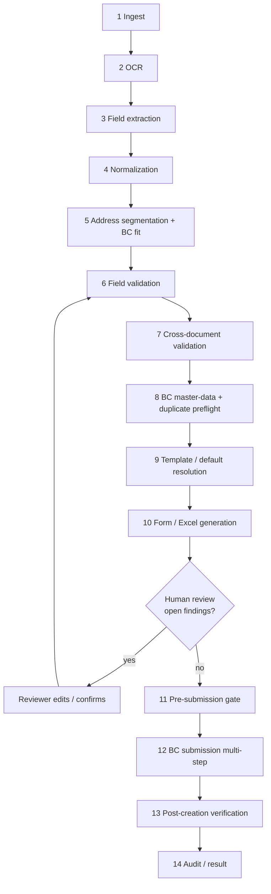

# BC Vendor Pipeline Integration

Companion to [BC_VENDOR_CONSTRAINTS_RESEARCH.md](BC_VENDOR_CONSTRAINTS_RESEARCH.md). This doc maps every constraint in [BC_VENDOR_CONSTRAINT_REGISTRY.md](BC_VENDOR_CONSTRAINT_REGISTRY.md) to the stage of **our** pipeline where it should be handled, and names the repo module that owns that stage today.

Code references:
- extraction and address code: `ocr-testing@a0e0fc8`;
- BC push code: `master@5677e46`, unless stated otherwise.

The two branches have diverged (see research report §2.4).

## Overview

**Where the repo is today:**
- Stages 1–7 and 10 exist and are strong.
- Stage 5's BC fit is missing.
- Stages 8, 9, 11 and 13 don't exist.
- Stage 12 is a single manual POST.
- Stage 14 is partial: run folders, and a "mark pushed" step with no verification.

---

## Stage 1: Document ingestion

| Aspect | Detail |
|---|---|
| **Enters** | Uploaded files (PDF, image, DOCX) |
| **Repo** | `services/extraction.py::store_uploads`, `services/onboarding_extraction.py::_save_upload`, `extraction_pipeline/ingest/document_loader.py` |
| **Checks** | Supported type; readable; page count; text-layer trust (image-coverage rule, exists) |
| **Constraints** | C-SEC-03 (retention of uploads) |
| **Errors** | `DOCUMENT_UNREADABLE` |
| **Auto-fix?** | No |
| **Review?** | If unreadable |
| **Output** | `DocumentSet`; files under `uploads/<run_id>/` |
| **Change** | Add a retention/purge policy for `uploads/<run_id>/` once the vendor is VERIFIED or rejected. Don't log file contents. |

## Stage 2: OCR

| Aspect | Detail |
|---|---|
| **Enters** | Page images / text layers |
| **Repo** | `ingest/ocr_engine.py` (RapidOCR/OpenVINO active; PaddleOCR fallback) |
| **Checks** | Span confidence (drop score 0.30), no hallucination (charset choice) |
| **Constraints** | Feeds every identifier constraint. OCR risk profile in validation design §9. |
| **Errors** | – (low-confidence spans surface later as `LOW_CONFIDENCE`/`OCR_AMBIGUOUS_CHAR`) |
| **Auto-fix?** | No |
| **Review?** | No |
| **Output** | `TextSpan`s with confidence; `document_set.json` (contains every identifier: C-SEC-03) |
| **Change** | None for BC. Treat `document_set.json` as sensitive (purge with the run). |

## Stage 3: Field extraction

| Aspect | Detail |
|---|---|
| **Enters** | Spans + `field_dictionary.yaml` |
| **Repo** | `extract/field_matcher.py`, `extract/semantic_engine.py::SemanticEngine.extract` |
| **Checks** | Label similarity, proximity, pattern, OCR confidence; `min_accept 0.60`; caption-leak filter; `expected_documents` precedence |
| **Constraints** | C-GST-15 (GST registration type not extracted), C-BNK-07 (holder name not extracted), C-NRM-07 (keep raw) |
| **Errors** | `FIELD_NOT_FOUND`, `LOW_CONFIDENCE`, `CAPTION_LEAK` |
| **Auto-fix?** | No |
| **Review?** | Yes, for the above |
| **Output** | `FieldResult` per field with `alternatives` and provenance |
| **Change** | Add fields: `gst_registration_type` (for GST Vendor Type), `trade_name` (for Name 2 if adopted), `account_holder_name` (cross-check only). Persist the **raw** candidate text next to the normalized `value`. |

## Stage 4: Normalization

| Aspect | Detail |
|---|---|
| **Enters** | Raw candidate strings |
| **Repo** | `extract/normalizer.py` ops chosen per field in `field_dictionary.yaml` |
| **Checks** | – |
| **Constraints** | C-NRM-01…09, C-TYP-01/05 |
| **Errors** | `OCR_AMBIGUOUS_CHAR` (new), `INVALID_BANK_ACCOUNT` (from the raw-value check) |
| **Auto-fix?** | SAFE ops only (validation design §8). CANDIDATE repairs need a provenance note plus review. |
| **Review?** | For candidate repairs |
| **Output** | `normalized` value + `raw` + list of ops applied |
| **Change** | (1) `account_number`: replace `digits_only` with "remove spaces/hyphens" plus the raw regex. (2) `fix_ifsc_confusions`: emit a note when it changes anything. (3) `split_corporate_suffix`/`expand_known_phrase`: emit a note. (4) Newline → `", "` in address text. |

## Stage 5: Address segmentation (+ BC fit)

| Aspect | Detail |
|---|---|
| **Enters** | `address_1` blob and captioned city/state/PIN |
| **Repo** | `extract/address_resolver.py::resolve_address_blob(multiline=True)`, `extract/address_segmenter.py::segment_leftover` / `_split_by_role` (ocr-testing), called from `semantic_engine._resolve_combined_address` |
| **Checks** | PIN directory, state canonicalization, district-aware city, role split, confidence |
| **Constraints** | C-ADR-01…10, C-LEN-03/04/05/06 |
| **Errors** | `ADDRESS_REBALANCED`, `ADDRESS_OVERFLOW`, `PIN_STATE_MISMATCH` |
| **Auto-fix?** | **Boundary shift only** (validation design §7) |
| **Review?** | If rebalanced, overflowed, or low confidence |
| **Output** | Address 1, Address 2, City, State, PIN, each with provenance + BC-fit status |
| **Change** | Add `bc_address_fit.fit_to_bc()` as a pure post-pass over the segmenter's own fragments and boundary. Don't change `_split_by_role` semantics. Keep `address_3`/`address_4` empty (already the case on `ocr-testing`). |

## Stage 6: Field-level validation

| Aspect | Detail |
|---|---|
| **Enters** | Normalized values |
| **Repo** | `extract/validator.py::Validator.check`, `config/validation_rules.yaml`, triggered in `semantic_engine.extract` step 3 |
| **Checks** | Regex/length/enum/derived rules |
| **Constraints** | C-GST-04/05/06/19, C-PAN-01/02, C-TYP-02/03, C-BNK-03/04, C-REQ-02, and the BC length checks as early **warnings** (the hard gate is stage 11) |
| **Errors** | `INVALID_GSTIN`, `INVALID_PAN`, `INVALID_PIN`, `INVALID_IFSC`, `INVALID_BANK_ACCOUNT`, `INVALID_EMAIL`, `INVALID_PHONE`, `FIELD_REQUIRED`, `FIELD_TOO_LONG` (warning) |
| **Auto-fix?** | No (except the config default for country, which becomes AUTO_LOOKUP in stage 8) |
| **Review?** | Yes |
| **Output** | `validation_status` + findings |
| **Change** | Add the §11 validators (checksum, holder type, raw account no., BC e-mail/phone rules, state-code allow-list). Fix the misleading "checksum" comment in `config.py`. |

## Stage 7: Cross-document validation

| Aspect | Detail |
|---|---|
| **Enters** | Per-document best candidates |
| **Repo** | `semantic_engine.extract` step 4 → `validator.compare_across_documents` (fuzzy ratio ≥ 0.85); `semantic_engine` step 4b (PIN↔state); optional `gstin_verification.verify_gstin` (master: `services/extraction.py::_apply_gstin_verification`) |
| **Checks** | Agreement per field |
| **Constraints** | C-XD-01…09, C-GST-16/17, C-PAN-03 |
| **Errors** | `CROSS_DOCUMENT_MISMATCH`, `GSTIN_STATE_MISMATCH`, `NAME_PAN_INITIAL_MISMATCH`, `GSTIN_NOT_ACTIVE` |
| **Auto-fix?** | No |
| **Review?** | Yes. BLOCK for identifier mismatches. |
| **Output** | `consistency` per field + findings |
| **Change** | Exact comparison for identifier `value_type`s (C-XD-01). Add the GSTIN-state vs PIN-state vs address-state triangle, the PAN 5th-char check, and the holder-name check. |

## Stage 8: BC master-data validation and duplicate preflight (new)

| Aspect | Detail |
|---|---|
| **Enters** | Validated values + BC target profile |
| **Repo** | **None today.** New module, e.g. `services/bc/lookups.py`, with a cached, read-only BC reference snapshot (countries, states with GST codes, posting groups, payment terms/methods, assessee codes, post codes for the PINs in play, vendor number series info) refreshed from a machine that can reach BC. |
| **Checks** | Code existence; GSTIN digits → `State.Code`; country name → code; duplicate GSTIN/PAN/bank account/name in **BC** (not just the portal DB) |
| **Constraints** | C-MD-01…09, C-GST-03/18, C-DUP-02…08, C-CFG-01/02/07, C-LOC-01/02 |
| **Errors** | `MASTER_DATA_NOT_FOUND`, `INVALID_COUNTRY`, `INVALID_STATE`, `NO_SERIES_MISSING`, `DUPLICATE_*`, `TENANT_FIELD_UNKNOWN` |
| **Auto-fix?** | AUTO_LOOKUP (resolve to an existing code only) |
| **Review?** | For misses and duplicates |
| **Output** | Resolved BC codes + duplicate report |
| **Change** | Because the portal host can't reach BC (VPN), use the "reference snapshot" pattern: a scheduled export (or the push host) refreshes a JSON snapshot the portal can read. The duplicate check is repeated **live** at stage 12, step 0. |

## Stage 9: Vendor template / default resolution (new)

| Aspect | Detail |
|---|---|
| **Enters** | Resolved codes + vendor class facts (GSTIN present, country, MSME…) |
| **Repo** | Today: env vars `BC_GEN_BUS_POSTING_GROUP` / `BC_VAT_BUS_POSTING_GROUP` / `BC_VENDOR_POSTING_GROUP` applied to every vendor (`bc_mapper.vendor_to_bc_payload`) |
| **Checks** | Exactly one class rule matches; every default exists in BC |
| **Constraints** | C-API-02, C-CFG-03/04/05, C-REQ-03, C-TDS-01/02, C-MD-06 |
| **Errors** | `CONFIGURATION_MISSING`, `TEMPLATE_AMBIGUOUS`, `MISSING_TDS_CONFIGURATION` |
| **Auto-fix?** | AUTO_LOOKUP from `vendor_class_rules.yaml` (validation design §5) |
| **Review?** | If ambiguous or missing |
| **Output** | Complete intended BC record (vendor + India tax fields + bank account) |
| **Change** | Replace the global env defaults with class rules. A placeholder never reaches BC. |

## Stage 10: Vendor form / Excel generation

| Aspect | Detail |
|---|---|
| **Enters** | Canonical values (+ BC-fit status) |
| **Repo** | `excel/excel_mapper.py::ExcelMapper.fill`, `excel/verifier.py::verify_excel`, mapping `config/excel_mappings/vendor_creation_v1.yaml` |
| **Checks** | Write-then-read-back integrity (exists) |
| **Constraints** | C-IMP-02/03, C-TYP-06, C-UI-02 |
| **Errors** | Verifier FAIL |
| **Auto-fix?** | No |
| **Review?** | Human reads the form |
| **Output** | `vendor_filled.xlsx`, `verification_report.json` |
| **Change** | The Excel form is a **request form, not a BC import**, so BC applies no validation to it. Add BC-fit indicators (e.g., cell comment "Address 2 is 69/50 chars for BC") so a human typing it into BC sees the problem. `address_3`/`address_4` rows (B40/B41) will stay empty with the new segmenter; keep or drop them (form-design decision). |

## Stage 11: Pre-submission gate (new)

| Aspect | Detail |
|---|---|
| **Enters** | Intended BC record + all findings |
| **Repo** | **None today.** `routers/business_central.py::vendor_bc_payload` builds the payload for any saved vendor, even with invalid/flagged fields, and `master`'s `bc_mapper._fit_to_bc_width` truncates. |
| **Checks** | Zero BLOCK and zero open REVIEW findings; every mapped property verified in `$metadata`; every length ≤ the target profile; every code resolved; payload contains no derived-but-unconfirmed value |
| **Constraints** | C-LEN-*, C-NRM-08, C-API-03, C-TYP-04, C-GST-08…14, C-PAN-04, C-WF-02 |
| **Errors** | Any of the above → HTTP 409/422 from the payload endpoint with the finding list |
| **Auto-fix?** | No |
| **Review?** | – |
| **Output** | Signed-off, ordered **submission plan** (validation design §6), not a single JSON blob |
| **Change** | Remove `_fit_to_bc_width` and the Address 2 join from `bc_mapper`. The gate replaces truncation. |

## Stage 12: BC submission

| Aspect | Detail |
|---|---|
| **Enters** | Submission plan |
| **Repo** | Today: `scripts/push_to_bc.ps1` POSTs one `VendorCard` body; the operator copies the BC No. back by hand (`docs/BC_VENDOR_PUSH_GUIDE.md`) |
| **Checks** | Step 0 live duplicate check; per-step success |
| **Constraints** | C-GST-01/02/12, C-BNK-01/08, C-API-04/05/06/07/08/09, C-DUP-07, C-SEC-05/06 |
| **Errors** | `BC_*`, `INT_UNREACHABLE`, `INT_TIMEOUT_UNKNOWN_OUTCOME`, `INT_PARTIAL_CREATE` |
| **Auto-fix?** | Resume from the failed step. Never re-POST without the step-0 check. |
| **Review?** | For BC rejections |
| **Output** | BC vendor No. (from the response, not typed), per-step status |
| **Change** | Multi-step executor (PowerShell or Python on the VPN host), reading a plan JSON from the portal and posting results back (or saving a result file the portal ingests). HTTPS to BC. |

## Stage 13: Post-creation verification (new)

| Aspect | Detail |
|---|---|
| **Enters** | BC vendor No. |
| **Repo** | None. "Mark as pushed" just stores the typed No. (`routers/business_central.py::mark_vendor_pushed`). |
| **Checks** | `GET VendorCard('<No>')` + bank account; diff every intended field; check the India side effects (GST Vendor Type), Post Code overwrites, approval status, Blocked |
| **Constraints** | C-ADR-05, C-GST-07, C-MD-03, C-WF-01/05 |
| **Errors** | `INT_VERIFY_MISMATCH` |
| **Auto-fix?** | No |
| **Review?** | For any diff |
| **Output** | VERIFIED or VERIFY_MISMATCH + diff |
| **Change** | New. Also used by a periodic reconcile job (vendor deleted/renamed in BC). |

## Stage 14: Audit / result generation

| Aspect | Detail |
|---|---|
| **Enters** | Everything above |
| **Repo** | `services/run_state.py`; DB columns `raw_extraction`, `fields_needing_review`, `bc_status`, `bc_no`, `bc_synced_at`, `bc_error` |
| **Checks** | Completeness of the audit trail |
| **Constraints** | C-SEC-01/02/03/07/08, C-WF-05 |
| **Errors** | – |
| **Auto-fix?** | – |
| **Review?** | – |
| **Output** | Per-vendor audit record (who reviewed what, which values were derived or repaired, submission steps, BC read-back) |
| **Change** | Add a review-decision log. Mask identifiers in lists. Set retention for `raw_extraction`. Enable BC Change Log / field monitoring on Vendor Bank Account and the GST/PAN fields (BC admin). |

---

## Constraint → stage index

| Category | Stages |
|---|---|
| FIELD_LENGTH | 5 (address), 6 (warn), 11 (gate) |
| DATA_TYPE | 4, 6, 11 |
| REQUIRED / CONDITIONAL | 6, 9, 11, 12 |
| ENUM | 9, 11 |
| MASTER_DATA | 8, 9 |
| ADDRESS | 5, 7, 11, 13 |
| GST / PAN / TDS | 3 (type, holder), 6, 7, 8, 9, 12 (ordering), 13 |
| BANK | 3, 4, 6, 7, 8 (duplicates), 12, 13 |
| DUPLICATE | 8, 12 (step 0) |
| API / UI / IMPORT | 10, 11, 12 |
| SECURITY | 1, 2, 12, 14 |
| WORKFLOW | 11, 13, 14 |
| CONFIGURATION / LOCALIZATION | 8, 9, 11 |
| CROSS_DOCUMENT | 7 |
| NORMALIZATION | 4 |
